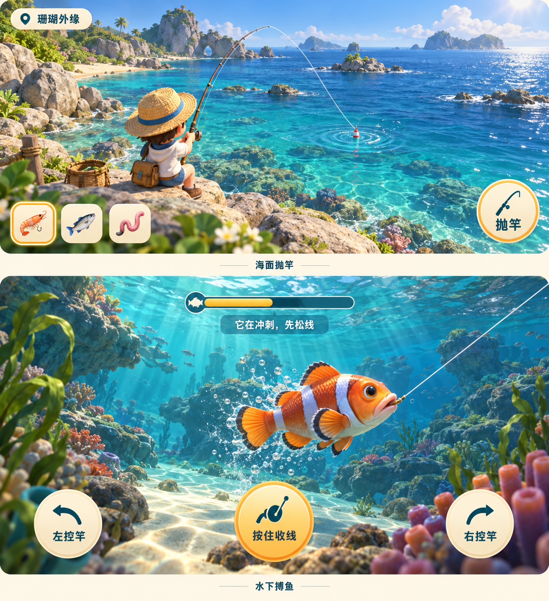
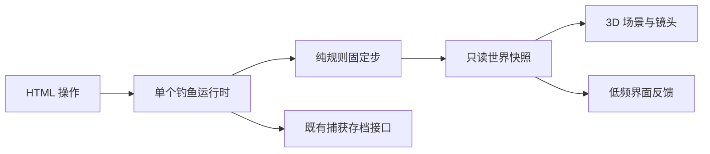

# 3D 钓鱼实现设计

版本 1.7 · 2026-10-08 · G1–G4 与 G5 教学／自适应画质／记录工具已实现；用户确认以 3D 替换旧版，正式入口已切换，iPad 真机与亲子试玩仍待验收。目标数值仍需试玩校准，阶段证据见 [实施计划第 2.13–2.17 节](archive/2026-10/IMPLEMENTATION_PLAN.md)，入口检查见 [当前记录](evidence/fishing-entry-browser.json)。

本文维护现行设计与验收条件；当前进度和剩余优先级见 [PROJECT_STATUS.md](PROJECT_STATUS.md)，操作表单见 [G5_PLAYTEST.md](G5_PLAYTEST.md)。

## 1. 交付目标与范围

做一款孩子能看懂、愿意再玩一次的轻量 3D 钓鱼游戏：**海面观察与抛竿 → 咬钩提竿 → 海面控竿／收放线 → 临岸抄起 → 揭晓与放生**。鱼在空间中的移动必须对应操作结果，张力条只是辅助反馈。

采用用户选中的美术方向；同日反馈已将完整流程的拉鱼镜头改为海面，原水下视角留在三动作练习：



概念图是 AI 生成的画面参考，不是可运行的 3D 场景、模型或实测效果。第一版优先保住体积、空间层次、鱼的动作与清晰操作；细密珊瑚、折射和复杂光影在性能允许时逐步补齐。概念图中饵图标仅作视觉示意，实际仍使用现有虾型／藻食型／拟饵三种配置。

| 范围 | 本轮实现时的决定 |
| --- | --- |
| 第一场原型 | 珊瑚外缘，一个固定岸边钓位；眼斑双锯鱼外观验证，三个可选择的开发行为样本 |
| 完整替换 | 两钓场、12 个现有物种、三种鱼饵、三处落点、独立钓鱼、辅助模式、图鉴与放生 |
| 操作 | 按住收线、松开放线、左右控竿；基本操作均有 HTML 按钮和键盘入口 |
| 图形 | 钓鱼场景采用 3D；现有创造工坊、试游、我的海洋与图鉴继续使用共享 Canvas 鱼渲染 |
| 数据 | 沿用现有物种 ID、捕获凭证、设置与备份，3D 模型不写入用户备份 |
| 暂缓 | 自由走动、开放世界、装备经济、体感、联机、天气系统、真实鱼线多节点物理、长度／重量纪录 |

三个动作样本首先验证操作差异，不宣称小丑鱼在现实中具有三个对应的行为类型。正式鱼种的行为配置属于游戏设定。

## 2. 场景与镜头

**同一世界、一个渲染器、稳定海面镜头**。完整流程不再自动下潜；岸边人物、鱼竿和浮漂持续可见。水下受力仍由同一规则计算，画面用鱼影、浮漂、水花与张力反馈它。原水下镜头仅用于 G2 三动作练习。建立岸边、浅水、深水、抄鱼区四个空间区域。

| 阶段 | 镜头与主要画面 | 操作／反馈 |
| --- | --- | --- |
| 准备 | 岸边角色背后偏上；角色约占画面五分之一，三处涟漪可见 | 选饵，点落点；键盘用近／中／远按钮选择 |
| 抛竿与等待 | 镜头稳定，竿、抛物线、浮漂在同一世界位置 | 抛投轨迹有清楚终点；轻触与吞饵的浮漂动作不同 |
| 咬钩 | 先显示浮漂沉下和“咬钩了”，保留提竿按钮 | 默认 2.5 秒，辅助 5 秒；转镜头期间不吃掉操作窗口 |
| 搏鱼 | 保持海面镜头，鱼线连接移动浮漂，鱼影与扩散水花反馈发力 | 左右控竿、收放线；鼓轮按实际收线量转动，松线／暂停停止；提示区显示冲刺／横游／下潜 |
| 临岸 | 鱼进入浅水抄鱼区，浮出近岸水面，镜头保持稳定 | 大按钮“轻轻抄起”；辅助自动完成；无严苛限时 QTE |
| 捕获／放生 | 岸边抄起鱼与现有知识卡；放生后游回水里 | 新发现／再次遇见；保存状态独立显示，失败可重试 |

完整流程采用稳定镜头，不绕鱼旋转或自动下潜。原练习镜头过渡约 0.5 秒，固定步规则照常执行。减少动态关闭鼓轮转动、晃动与动态水花，保留收线文字、浮漂位置和操作反馈。首版不提供自由镜头拖动，避免和控竿争抢触摸。

水面镜头看到海水浅深层次和浮漂；水下镜头关闭遮挡鱼的水面正面材质，保留水面背面的低成本波纹与海底光斑。采用可控的游戏表现，不承诺实时真实折射。

## 3. 操作与布局

- 横屏平板／桌面：画面主体占据注意力中心；左下左右控竿，右下按住收线。张力风险和动作提示靠近鱼，但不盖住鱼头、鱼线与落点。
- 竖屏手机：镜头安全区重新构图，控竿与收线放在画面下方，按钮至少 44px；保留完整操作，不强制横屏。首轮教程提示“按住收线，绷紧时松手”。
- 键盘：空格按住收线；左右箭头控竿；提竿与抄起使用聚焦按钮的空格／回车。正文输入框与其他按钮有焦点时，不全局劫持空格或箭头。不通过 key repeat 增加收益。
- 触摸支持一手按住控竿、另一手收线；每个按住动作按 pointerId 跟踪。抬起、取消、离开对应按钮、失焦、后台和离开页面都释放输入。相反方向同时按住取零，松开一个后恢复另一个方向。
- 抛投同时提供点击 3D 涟漪和 HTML 落点按钮。Raycast 只命中定义好的落点区域，再发送相同 spot ID；UI 覆盖区不触发抛投。
- 辅助模式根据鱼的横向动作协助竿向，放宽连续危险容错；三个动作仍可见，捕获记录完全相同。连续失败两次继续给辅助建议。
- 声音默认关闭；浮漂、竿形、动作和文字可以独立解释玩法。读屏播报阶段与危险状态变化，不逐帧播报坐标或张力。

本轮原型按“显示鱼的动作 → 允许反应 → 反馈结果”验证交互。动作提示用于教学；试玩后逐渐减少重复文字。

## 4. 状态与规则模型

### 4.1 阶段与命令

扩展现有阶段：`setup → casting → waiting → bite → fighting → landing → caught → released → setup`；过早、错过咬钩、持续过紧或搏鱼超时进入 `escaped`。`landing` 成功后才发捕获记录。离开未完成的一轮不记发现，也不计失败。

新增 `setRodAxis(-1..1)`、`land`，保留 `cast`、`pull`、`reel`、`release`、`retry`、`setAssist`、`cancel` 和固定步 `tick`。只有规则入口能改变物种、阶段、位置、张力与疲劳；镜头过渡不是新的游戏阶段。

已在 `src/domain/fishing3d/` 定义不依赖 Three.js、Vue、DOM 的数据，核心字段如下（实际类型另含阶段、样本和独立随机状态）：

```ts
type Vec3 = { x: number; y: number; z: number };
type FishAction = 'telegraph' | 'sprint' | 'lateral' | 'dive' | 'rest';
interface FightState3D {
  fishPosition: Vec3;
  fishVelocity: Vec3;
  fishHeading: Vec3;
  rodTip: Vec3;
  rodAxis: number;          // -1 左，0 居中，1 右
  lineLength: number;
  tension: number;          // 内部可超过 1；显示时裁剪，不抹掉超限信息
  fatigue: number;          // 0..1
  action: FishAction;
  actionTicks: number;
  nextAction: Exclude<FishAction, 'telegraph'>;
  breakTicks: number;
  elapsedTicks: number;
}
```

规则坐标约定：Y 向上，水面 Y=0，X 沿岸线左右，Z 从岸边向海，采用米作游戏尺度。G1 场景岸线位于世界 Z=5.5，朝负 Z 向海；G2 通过唯一 `coordinates.ts` 将规则点转换为世界点 `(x-0.7, y, 5.5-z)`，朝向相应转换，避免重建 G1 场景。游戏尺寸与移动速度不写成生物学事实；正式模型加载后的旋转／缩放由资源清单转换一次。

规则的鱼位置表示身体中心，头部朝向与物种嘴部偏移共同派生钩点。鱼线连接钩点；渲染器必须对齐同一个嘴部锚点，不能画线连到鱼尾或在鱼移动时脱开。

### 4.2 拉力如何改变鱼的位置

初版用简化弹性／阻尼与受力积分，暂不引入额外刚体物理库：

1. 输入决定竿的目标方向；竿尖由方向与上一固定步的受力弯曲派生，避免循环求解。
2. 计算钩点到竿尖的距离 d、单位方向 n、放线长度 L，伸长量 `max(0, d-L)`。鱼中心和竿尖的沿线相对速度参与简化阻尼；核心系数来自版本化配置，原型未求解嘴部旋转产生的角速度。
3. 拉力为非负的弹性／阻尼结果；内部张力为拉力相对断线参考值。拉力沿线反向作用于鱼，鱼动作提供推进力，水阻力限制速度。
4. 按住收线缩短 L；松开停止主动收线，鱼在有拉力时能带走一部分线。放线设置速度与长度上限，不能一松手就瞬间清空拉力。
5. 用半隐式 Euler 按 1/60 秒更新速度与位置。越过水面、海床或场景边界时限制法向速度并做小范围位置修正；不借边界处理瞬移到岸边。
6. 疲劳来自持续有效拉力和动作消耗，喘息时有适度恢复；高疲劳降低鱼的推进力。控竿改变竿尖和受力方向，不能只修改显示角度。

正常收线能使距离缩短；冲刺强拉可使鱼带线离岸，继续硬收增加风险；鱼喘息时最容易靠岸。若初始参数不能稳定体现三种结果，先调规则，不用动画掩盖。

G2 已校准配置 **g2.1**：等效质量 1kg、弹性系数 6N/m、轴向阻尼 1N·s/m、水阻力 1.5、断线参考力 9N、收线 0.6m/s、被动放线速度上限 1.2m/s、鱼速上限 1.8m/s、线长范围 1.5–18m。初始线长由钩点／竿尖距离计算，初始张力为零；竿尖与方向按 6/s 平滑响应，避免受力弯曲的反馈跳变。疲劳每秒变化为 `0.11 * min(张力,1.4) + 动作项`，主动动作项 +0.018，喘息／预兆项 -0.006；该公式替代尚未校准的初始 0.02–0.04/s 建议。鱼中心边界 X[-5.5,5.5]、Y[-2.2,-0.45]、Z[0.12,14] 给头部与鳍留出水面／海床余量。这些都是游戏系数；配置冻结，有限数值与输入边界有回归检查，不能当作实际鱼线力学参数。

成功条件采用**鱼到抄鱼区的水平距离、浅水深度与疲劳**共同判断；g2.1 为水平距离 ≤1.2m、Y≥-0.6m、疲劳≥0.7。不能用钩点到高处竿尖的全距离做这一判断，以免鱼永远达不到临岸条件。G2 进入 `landing` 后冻结当前规则位置和计时，不瞬移，按钮抄起进入 `caught`；辅助抄起在 G3 接入。

删除独立累计的 `progress += 常数` 胜负条件。可见“距离”直接从当前鱼位置派生，竿弯曲来自拉力，线垂度来自剩余松线；渲染器不另算输赢。

### 4.3 可学习的鱼动作与容错

| 动作 | 0.4–0.8 秒预兆 | 推进／反馈 | 玩家回应 |
| --- | --- | --- | --- |
| 冲刺 | 转身，尾摆变快 | 短时离岸加速，张力与竿弯曲增加 | 暂时松线，结束后再收 |
| 横游 | 鱼头指向左或右 | 沿岸方向移动，鱼线明显倾斜 | 相反方向控竿 |
| 下潜 | 鱼头向下，身体倾斜 | 深度增加，拉力上升 | 放线，等上浮／喘息 |
| 喘息 | 尾摆减慢 | 推进力下降，收线更有效 | 稳住方向收线 |

动作序列使用独立的 seeded RNG 状态，不每帧随机抽取；最短持续时间限制抖动。现有物种抽样和原创鱼偶遇的随机流保留独立，新增光斑、泡泡不能消耗业务随机数。三种行为配置以主要动作比例区分；另以物种 game.size 控制大小难度。小鱼使用基线，大鱼拉力 ×1.25、惯性 ×1.2、耐力 ×1.3，超时 72 秒。G4 已接入 12 种鱼及既有大小配置；不是逐条随机长度或重量。

初始节奏目标：等候 3–8 秒；提竿 2.5 秒／辅助 5 秒；搏鱼 12–22 秒；完整一轮约 20–40 秒（不含自主阅读知识卡）。G2 实现 0.6 秒预兆，冲刺／横游／下潜持续 2／2.4／2.5 秒，随后喘息 3.5 秒。张力 >1 时危险计时增加，安全步以双倍速度恢复，累计连续危险约 1.2 秒才逃走；硬超时 60 秒。G2 的 60 个策略样本全部到岸，耗时 11.35–29.08 秒，下潜型部分超过 22 秒目标，仍需亲子试玩调参；30 秒温和提示、辅助 2 秒容错与完整轮次在 G3 接通。原版 45 秒属于历史规则，不能把历史耗时和新规则混为实测结果。

## 5. 工程接入

选择 **现有 Vue 3 + TypeScript + Vite，加 Three.js WebGLRenderer**。一个 Canvas 承载 3D，HTML 承载全部操作和知识卡；不重建应用或替换 IndexedDB。Three.js 官方支持 npm／Vite 组合；当前 WebGLRenderer 要求 WebGL 2。[安装](https://threejs.org/manual/pages/installation.html)、[渲染器](https://threejs.org/docs/pages/WebGLRenderer.html)。G1 已精确锁定 **three 0.186.1 / @types/three 0.186.0**，类型检查和实际浏览器验证通过。

```text
src/domain/fishing3d/       state.ts / simulate.ts / actions.ts / config.ts
src/features/fishing3d/    runtime.ts / input.ts / capture.ts
src/rendering/fishing3d/   renderer.ts / cameras.ts / world.ts / fish.ts / rod.ts
src/catalog/fishing3d.ts   场景、模型、嘴部锚点、动作配置与资产版本
src/components/           FishingScene3D.vue / FishingControls.vue / FishingFallbackScene.vue
public/models/fishing/  已审核的模型、纹理、声音与资源清单
tests/                    规则、资产契约、捕获集成测试
```

以上为完整规划目录。G1 已实现运行时、固定步时钟、镜头、世界、鱼、资源所有权与场景组件；G2 新增 `state.ts`、`config.ts`、`simulate.ts`、`input.ts`、`coordinates.ts`、`FishingControls.vue` 并接通开发页。动作逻辑暂与模拟同文件；捕获服务、fallback 和正式 GLB 在对应阶段建立。模块依赖如下（存档箭头为 G3 规划）：



- **一个时钟**：运行时拥有唯一固定步累计器与渲染循环，完整流程每个 1/60 秒步调用会话的 `stepRound`，搏鱼阶段再调用 `stepFight`。Three.js 对象留在运行时，避免 Vue 深响应式逐帧改场景；当前诊断／周期快照约每 500ms 更新，命令与阶段变化另及时发布。
- **一个状态源**：渲染读取快照；帧间可以插值表现，不能反馈新位置回规则。镜头、音效、特效读取事件，不能自行切 `caught`。
- **正式接入**：`/fishing/:habitatId` 已接完整轮次、`CatchCard.vue` 与两场各 6 份预载 GLB，候选权重沿用 `candidateWeights`，正常构建与局域网默认进入 3D。旧开发／候选查询链接兼容；G2 练习仅在开发 `/dev/fishing-3d/practice`，不写数据库。入口切换按用户确认执行，G5 真机与家庭证据仍待补齐。
- **已有内容**：`speciesFor`、`candidateWeights`、`recordCapture`、偏好设置、知识卡和灵感配色保持语义；新 fight 配置放独立映射，不把 `wave` 自动解释为真实下潜行为。
- **原创鱼偶遇**：保留独立判定和问候，搏鱼／临岸期间推迟。已有自绘鱼先由共享 Canvas 渲染成透明纹理，作为明确的手绘访客小卡路过，不伪装为真实 3D 物种、不丢发光层、不参与捕获。
- **存档**：仅 `caught` 的应用服务调用 `recordCapture(attemptId,speciesId)`，重试复用 ID；读取保存结果再显示“已记入图鉴”。失败保留结果与重试按钮，不能提前宣称保存成功。本轮不改数据库版本或备份 schema。

## 6. 3D 素材与美术交付

G1 的圆润原型网格用于技术验证，G4 用正式素材替换；第一场不能只有一张概念图当背景、一条 2D 鱼贴图，再称为 3D 游戏。

| 资产 | 首场需求 | 正式版契约 |
| --- | --- | --- |
| 岸边场景 | 岩岸、浅海床、几块礁石、珊瑚、远岛 | 两场共享模块与材质，地形和水深配置不同；世界边界与抄鱼区显式定义 |
| 角色 | 一个固定钓位的草帽角色 | 抛竿、持竿、提竿、抄起四段简短动作；角色与钓竿基座锚点匹配 |
| 竿／线／浮漂 | 分段弯曲竿、动态线、浮漂与饵 | 竿尖和鱼嘴锚点来自规则，线显示松弛；不模拟每节线碰撞 |
| 真实鱼 | 眼斑双锯鱼，圆润体积、可辨认白带与鳍 | 12 个 ID 各自对应外形审核；身体、尾鳍、胸鳍、嘴部锚点明确，不能只换颜色复用错误外形 |
| 水与光 | 深浅渐变、低幅水面法线／波动、海床光斑 | 支持质量档；水下鱼始终可见，关闭复杂效果仍有空间参照 |
| 声音 | 既有提示音先复用 | 补绕线轮／放线／水花；遵守静音和后台暂停 |

正式模型采用 glTF 2.0／GLB；原型可以代码生成网格。每份模型验证尺度、朝向、嘴部锚点、边界、动画轨道；鱼实例互不共用可变骨骼状态。色彩图用 sRGB，法线／粗糙度图作为非色彩数据；统一灯光和曝光后检查颜色。[GLTFLoader](https://threejs.org/docs/pages/GLTFLoader.html)、[色彩管理](https://threejs.org/manual/pages/color-management.html)。

`asset-manifest.json` 记录资产 ID、相对路径、资源版本、来源／授权、文件大小、三角形／纹理预算、锚点和审核状态。全部同源，禁止运行用户导入模型或远程贴图。3D 不依赖孩子上传图片，用户备份只保存现有笔迹与玩法数据。

生成概念图不能直接变成 GLB。首轮正式美术需要可编辑模型与纹理产出；若正式模型尚未就绪，阶段报告明确“灰盒”，不能以效果图代替验收。素材不足不会阻断 G1–G2 的可玩验证。

## 7. 性能、加载与资源生命期

这些为开始测量的预算，不是现有成果：

| 项目 | 首场初始目标 |
| --- | --- |
| 帧率 | 桌面约 60fps；iPad 第九代或等效真机连续 60 秒平均 ≥30fps，p95 帧时间 ≤50ms |
| 图形预算 | 同屏总三角形约 ≤150k，主鱼 ≤8k；总 draw calls ≤80（含阴影等通道）；背景鱼 ≤6 条 |
| 图片预算 | 主鱼／主要场景单纹理 ≤1024px，移动档 512px；估算解码后纹理内存 ≤64MiB，不能用压缩文件大小代替 |
| 下载预算 | 首场所需代码／资产传输总量目标 ≤4MiB，剩余物种按需加载；不包含设计参考 PNG |
| 加载体验 | 首场冷加载 10Mbps 目标约 ≤5 秒，显示加载与失败重试；原有首页和工坊不加载 3D 包 |
| 像素与质量 | 起始 DPR 上限 1.5，动态降到 1；持续慢帧先降阴影／光斑／粒子，不改变模拟速度或奖励 |

一个方向光和环境补光，优先烘焙环境阴影或局部接触阴影。实时阴影先只覆盖角色／岸边，并计入总绘制预算；不为每条鱼或每块珊瑚开独立阴影通道。透明水材质控制层数，移动档不开实时平面反射、全屏景深和体积光。[阴影成本说明](https://threejs.org/manual/pages/shadows.html)。

模型先通过缓存加载、校验、构建与必要的材质预热，再进入抛竿；咬钩时不能等待鱼 GLB 网络加载而消耗提竿窗口。G3 前验证预载所选钓场资源，失败保持准备状态并重试，不钓到占位鱼。

页面卸载或切钓场：停止唯一循环、移除输入和监听、注销加载回调、释放未共享 geometry／material／texture、render target、解码 bitmap 与 renderer。晚到的异步加载按生命周期 generation 丢弃并释放；共享缓存有引用计数与容量上限。不要只删除 Scene 对象就视为资源释放。[资源清理](https://threejs.org/manual/pages/cleanup.html)。

后台、失焦、转屏过程与 context loss 都立即清空按住输入；后台和恢复等待时间不补算。WebGL context lost 时暂停并显示恢复入口；重建资源成功后继续本轮的业务状态，失败不记录捕获、不丢已保存数据。WebGL 2 不可用或初始化失败时，使用同一新版规则的简化 Canvas 画面与相同 HTML 控件，不把 2D fallback 当成 3D 验收成果。

## 8. 开发顺序与停止条件

从本设计提交创建 `codex/fishing-3d-prototype`；每阶段是可审查的独立提交。预估工期在 G1 实测加载／素材产出后再给，先以验收条件推进。

| 阶段 | 要改什么 | 当步可看见的交付 | 完成条件 |
| --- | --- | --- | --- |
| G1 场景与镜头 | 锁定 Three.js；开发入口、renderer、两镜头、原型岸边／角色／竿／鱼、加载与卸载 | 一屏真实 3D，海面和水下视角可切换，尚不写捕获 | 镜头、体积和空间层次可辨；鱼／竿不是平面贴图；一次主循环；首次加载失败和重复切页不泄漏；记录一台实机基线 |
| G2 核心拉锯 | 纯规则、三动作样本、控竿／收放线、钩点／张力／疲劳／临岸 | 一个从搏鱼到抄起的灰盒可玩原型 | 固定 seed 三种动作清楚；合理策略能靠岸，硬收会退线／危险；不同帧率和暂停一致；没有独立进度胜负变量 |
| G3 完整流程与数据 | 准备／抛竿／咬钩、知识卡、recordCapture、辅助、输入与 fallback | 空存档能完成一轮并刷新找回发现；旧数据仍可读 | 捕获只记一次；未捕获离开不记；保存失败可重试；WebGL 异常／触摸取消／焦点／转屏／旧备份恢复流程成立 |
| G4 美术与全部内容 | 用正式模型替换灰盒；第二钓场、12 物种、角色动作、水和声音、偶遇 | 接近概念图方向的两钓场版本 | 模型和真实鱼资料审核一致；两场独立可用；3D 包按需加载；手绘访客保留两层笔迹；移动档满足预算 |
| G5 真机、试玩与替换 | 首次教学、记录工具与正式入口切换已完成；真机调优、5–8 组亲子试玩待完成 | 默认 3D，可降级，现有数据沿用 | 真机／操作／知识／存档门槛仍需实测，修复主要障碍；入口切换不代表 G5 整阶段通过 |

第一轮实际开发只推进 G1，随后 G2 才判断是否值得投入完整美术。若单场在目标真机无法达到 30fps，先减少效果与资产；若 G2 只能靠盯条成功、看鱼无法判断操作，先返工拉锯和提示，不增加鱼种掩盖问题。

## 9. 新版验收清单

| ID | 必须验证的事情 | 方法 |
| --- | --- | --- |
| 3D-A01 | 海面与水下镜头对应同一鱼、同一钩点和时间，切换不重抽、不重置 | 固定 seed + 世界快照 + 浏览器 |
| 3D-A02 | 三动作有预兆和区别；控竿、放线、喘息收线带来可解释的位置变化 | 规则序列测试 + 人工试玩 |
| 3D-A03 | 30／60／120fps 输入序列的阶段、位置、张力在容差内一致；渲染质量档不改变规则 | 纯规则测试（位置差目标 ≤1cm，时间差 ≤1 固定步） |
| 3D-A04 | 松手、移出、pointercancel、双指、对向控竿、失焦、后台、恢复均不粘住按键 | 浏览器输入 + 真机触摸 |
| 3D-A05 | 镜头过渡不缩短咬钩窗口，减少动态／静音／键盘仍可完成 | 浏览器流程 + 可访问性核对 |
| 3D-A06 | 新发现与重复捕获、失败重试、刷新不重复写；旧备份 round-trip 不变 | 存档集成 + 浏览器 |
| 3D-A07 | 20 次进入／离开／切钓场，循环、监听、缓存和 renderer.info 资源无持续增长 | 有界稳定性测试 |
| 3D-A08 | context lost／模型失败／WebGL 2 不可用有恢复或同规则 fallback，记录无误 | 故障注入 + 浏览器 |
| 3D-A09 | 横竖屏下鱼、线、提示和按钮可见，无溢出、按钮 ≥44px；主鱼被珊瑚遮住时镜头可纠正 | 390×844／768×1024／1366×768 + 真机 |
| 3D-A10 | 12 种模型各自可辨，与来源资料对照；鱼种 ID 与既有图鉴一致 | 模型清单与内容审核 |
| 3D-A11 | 真实设备性能／首场冷加载符合目标，质量降级不改变难度 | 帧时间、网络／纹理预算记录 |
| 3D-A12 | 5–8 组亲子记录首次成功、误操作、是否理解松线和是否主动再玩 | 主持人记录，非统计成效结论 |

自动策略只校准规则边界；不能证明操作好玩。旧版 66 项测试和历史 A01–A27 验收仍属于旧版；新版 3D-A01–A12 在实施后单独记录证据。

## 10. 阶段结果摘要

已决定：钓鱼采用 3D 海面完整流程与水下动作练习、位置驱动的拉锯、一场先验证、五阶段实施；造鱼能力与存档保持既有契约。G1 已落实依赖、真实网格、共享世界与桌面基线；G2 已实现三动作样本、控竿／收放线、实际受力位置与临岸抄起，82 项回归和正式构建通过，具体浏览器证据见实施计划 2.14。自动策略不能证明操作好玩。

G3 已实现：`RoundSession` 持有唯一业务状态，WebGL 或 Canvas 仅一个活动时钟推进它；重建与切降级画面复用同一轮次。三个落点提供完整圆形 raycast 区域与 HTML 按钮，1.5 秒抛投、3–8 秒等待、2.5／5 秒咬钩窗口，提竿后从落点对应位置开始拉锯。抛竿经用户反馈重做为后摆蓄力、前甩释放、重力弧线与落水涟漪，鱼竿绕握柄转动并保持长度，浮漂释放前跟随竿尖；咬钩前鱼线只接浮漂，不接隐藏的鱼。辅助协助横游方向、允许 2 秒过紧并自动抄起，30 秒后给温和提示。仅 `caught` 提交现有 `recordCapture`，失败可在放生后本页重试；保存中的结果不会提前显示已记入图鉴。92 项回归、生产构建及浏览器完整／异常流程通过，证据见实施计划 2.15。

G4 已实现两场各 6 种鱼、12 份原创 GLB、明确定义的物种动作与大小、长吻锚点、灰岩岸与海草、角色收线和抄网、轻量声音，以及保留颜色和发光笔迹的手绘访客小卡。单鱼 5,232–7,180 三角形，全部 GLB 约 0.90 MiB；同场模型预载并预热，资源独立回收。该阶段 96 项回归、构建、模型总览、两场捕获／Canvas／加载故障／双层笔迹偶遇验证通过，具体历史证据见实施计划 2.16。

G5 开发准备已实现：可跳过／重看的三步教学打开时冻结同一轮咬钩窗口，并保留手动暂停；自动画质只在连续两个 5 秒窗口低于 30fps 或 P95 超过 50ms 后降为 DPR 1、简化水光与水花，手动选择优先，固定步规则和奖励不变。减少重复装饰球面的分段；平板横竖屏进入拉鱼时确保操作区进入视野。60 秒导出记录保留 UA／GPU／尺寸／画质、峰值预算和中断次数；未满 60 秒或有中断不能显示连续预算通过。最初仅独立 `fishing-preview` 候选构建接入 3D，2026-10-08 按用户确认推广至正式入口，保留同规则 Canvas 自动降级。G5 准备阶段的 98 项回归与构建通过；桌面模拟、冷加载和稳定性结果见实施计划 2.17，实际设备及 5–8 组家庭表单见 [G5_PLAYTEST.md](G5_PLAYTEST.md)。**G5 尚未取得真机与亲子证据，不能标为整阶段完成。**
