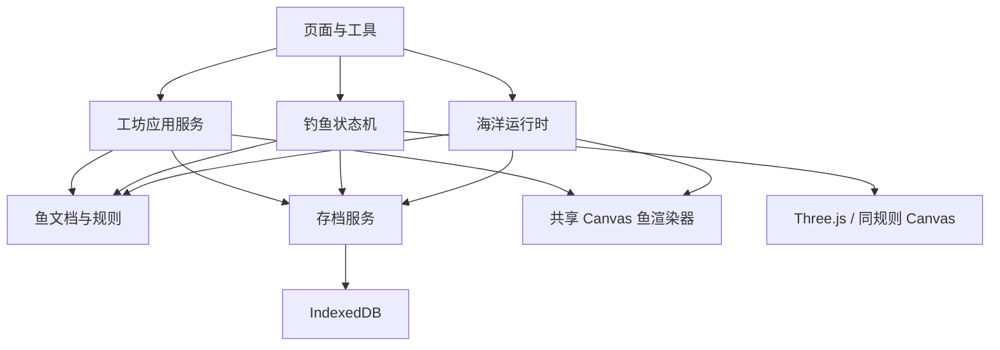
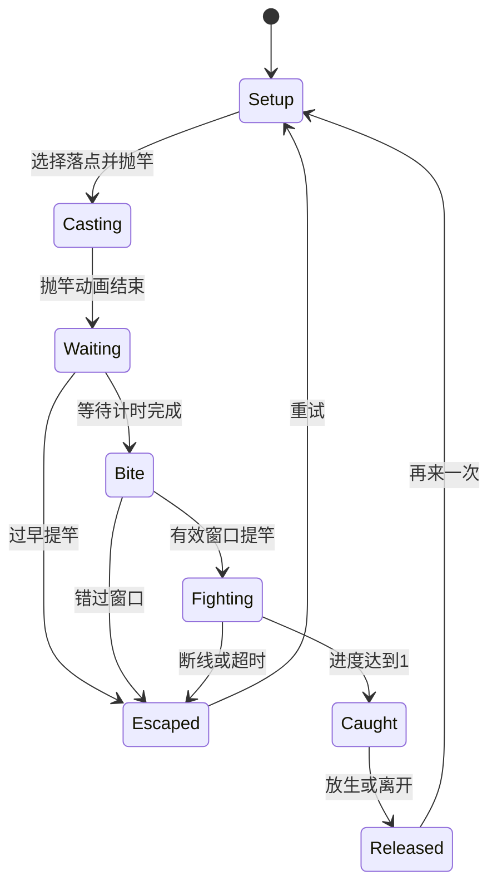

# fishfishfish 技术设计

2026-10-07 儿童操作整理：FishCanvas 的规范坐标六点塑形在主画面执行，手势中固定 placement，完成作为一步历史；工具切换结束旧手势。首页只读本机草稿／最近作品并释放缩略图位图。帮助在用户点击时播放，关闭／后台停止；原数据 schema、捕获凭证与备份规则保持。当前界面契约见 [儿童体验](CHILD_EXPERIENCE.md)。

2026-10-07 后续模块见 [13–20 样板](archive/2026-10/REMAINING_STAGE.md)：可选 FishDesign.sculpt，轮廓派生三维体积与双侧共享纹理、按需立体加载、20 鱼资源、PNG 鱼卡、本机 dialog 全屏和不上传的试玩记录。schema 1、资产规范坐标和捕获凭证保留；按用户选择无跨设备中转。

版本 0.8 · 2026-10-06 · 步骤 01–09、3D G1–G4 与 G5 开发准备已实现；真机与试玩待验收。当前状态见 [PROJECT_STATUS.md](PROJECT_STATUS.md)；旧版参数保留作历史契约，新版看第 7.5 节。

## 1. 技术决策与约束

| 决策 | 建议 | 原因与适用边界 |
| --- | --- | --- |
| 现有项目优先 | 接手先检查仓库及规范，复用既有栈 | 不因本文建议重建已有工程 |
| 无现有代码时 | Vue 3 + TypeScript + Vite，单页应用 | 适合交互工具和游戏控制面板；无需为首版本地游戏增加 SSR |
| 路由/状态 | Vue Router + Pinia 或既有等价方案 | 管理页面与低频 UI 状态；每帧位置留在引擎内 |
| 图形 | 工坊／海洋／图鉴继续共享 Canvas 2D；新版钓鱼采用 Three.js WebGL 2，HTML 做操作与卡片 | 已确认 3D 钓鱼体验，独立接入、不重建现有造鱼与存档 |
| 本地存储 | IndexedDB，封装 repository | 保存结构化文档和 PNG Blob；不用 localStorage 存纹理 |
| 后端 | P0 无后端、无账号、无实时同步 | 减少部署和隐私负担；未来通过 repository 接口扩展 |
| 测试 | 纯规则单测 + 存档集成 + 关键浏览器流程 | 优先覆盖数据完整性、时序与输入边界 |

本文不锁定依赖补丁号。实施时依据项目锁文件和所选构建工具的官方兼容要求锁定版本、Node 与包管理器；在 README 记录已验证组合，不复用旧项目的 Node 版本假设。若已有 Nuxt，只将 Canvas/IndexedDB 初始化置于客户端生命周期，不为遵从本文迁移整个应用。

工坊与海洋的图形升级仍以实际基准为依据；用户已确认的 3D 钓鱼是新的体验设计，按 [FISHING_3D_DESIGN.md](FISHING_3D_DESIGN.md) 接入独立渲染。业务数据保持与渲染库无关，捕获存档仍使用同一接口。

## 2. 模块边界



上图箭头是调用/依赖关系。纯规则模块不依赖 Vue、DOM、渲染器或 IndexedDB；应用运行时持有规则状态并调用渲染器，Canvas 不直接修改存档。工坊、试游池、海洋和鱼卡共用鱼文档与 Canvas 入口；真实鱼的 3D 模型读取对应物种 ID，手绘访客仍走共享 Canvas，避免笔迹丢失。

| 建议目录 | 职责 |
| --- | --- |
| `src/domain/` | 类型、参数校验、性格/彩蛋/游动规则、钓鱼纯函数 |
| `src/catalog/` | 部件、花纹、真实鱼、钓场、科普来源与配置版本 |
| `src/features/editor/` | 命令历史、输入映射、画笔、印章、试游 |
| `src/domain/fishing.ts`、`src/pages/FishingPage.vue` | 旧版纯规则、页面时钟与捕获接入 |
| `src/domain/fishing3d/` | 新版整轮／拉锯固定步、物种映射和共享表现坐标 |
| `src/features/fishing3d/` | 唯一会话、输入、渲染时钟、捕获服务、画质与测量 |
| `src/rendering/fishing3d/` | Three.js 世界、GLB 加载、相机、资源所有权与回收 |
| `src/features/ocean/` | 展示列表、巡游、选择和偶遇 |
| `src/rendering/` | FishRenderer、形状、动画、纹理合成与缓存 |
| `src/storage/` | IndexedDB、迁移、导入导出、修订冲突 |
| `src/components/` | HTML 工具栏、对话框、提示与无障碍操作 |
| `src/pages/` | 路由组合与生命周期 |
| `public/assets/` | 同源静态素材及授权记录 |
| `tests/` | 规则、存档和关键端到端流程 |

路由建议：`/`、`/create`、`/ocean`、`/fishing/:habitatId`、`/journal`、`/settings`；编辑既有鱼通过受校验的查询参数 `fishId`。深链接 ID 不存在时显示说明并返回列表，不能生成覆盖对象。

## 3. 领域模型

以下 TypeScript 为字段契约示意，实际定义与校验以 `src/domain/types.ts`、`src/domain/fish.ts`、`src/domain/draft.ts` 和 `src/catalog/` 为准。当前已支持完整部件、花纹、印章、两层笔迹、草稿／作品／设置／发现等实体；不是步骤 02 的缩减切片。ID 为 UUID 或固定配置 ID；时间存 ISO UTC，显示时使用设备时区；数值入库前拒绝 NaN/Infinity 并检查范围。

```ts
type HabitatId = 'reef-edge' | 'coastal-rock';
type Personality = 'lively' | 'relaxed' | 'curious';
type ColorSlot = 'body' | 'head' | 'fin' | 'tail';

interface FishDesign {
  schemaVersion: 1;
  bodyId: string;
  shape: { length: number; height: number; headRatio: number };
  parts: { headId: string; tailId: string; finId: string; eyeId: string; mouthId: string };
  colors: Record<ColorSlot, string>; // 首版只接受色卡中的 #RRGGBB
  pattern: { id: string; primary: string; secondary: string; size?: number; density?: number };
  paint: { resolution: 512; colorAssetId: string | null; glowAssetId: string | null };
  sculpt?: { top: [number, number, number]; bottom: [number, number, number] };
  arms?: { count: number; length: number; curl: number; color: string };
  stamps: Array<{
    id: string; kind: string; color: string; // color 来自色卡，步骤 04 新增
    u: number; v: number; scale: number; rotation: number;
  }>;
  mirroredSide: true;
}

interface OriginalFish {
  id: string;
  revision: number;
  name: string;
  createdAt: string;
  updatedAt: string;
  design: FishDesign;
  personality: Personality;
  preferredHabitat: HabitatId;
  effectEnabled: boolean;      // 玩家可关闭彩蛋特效
  activeEffect: EffectId | null; // 派生后保存，载入按 ruleVersion 检查
  ruleVersion: 1;
  lastCommandId: string;       // 最近一次成功提交的凭证，用于幂等
}

interface EditorDraft {
  id: 'current';
  revision: number;
  sourceFishId: string | null;
  sourceFishRevision: number | null;
  name: string;
  design: FishDesign;
  personality: Personality;
  preferredHabitat: HabitatId;
  effectEnabled: boolean; // 步骤 06 新增；旧草稿缺省为 true
  updatedAt: string;
}

interface SpeciesDefinition {
  id: string;
  commonNameZh: string;
  scientificName: string;
  renderPresetId: string;
  facts: Array<{ text: string; sourceUrl: string; checkedAt: string }>;
  reviewStatus: 'placeholder' | 'verified';
  realDiet: string;
  game: { // 与生物学资料分开，纯游戏配置
    habitatId: HabitatId;
    baitWeights: Record<string, number>;
    castWeights: Record<string, number>;
    fightPattern: 'steady' | 'burst' | 'wave';
    baseWeight: number;
  };
  inspiration: { colors: Record<ColorSlot, string>; patternId: string };
}

interface SpeciesDiscovery {
  speciesId: string;
  firstCaughtAt: string;
  lastCaughtAt: string;
  catchCount: number;
}

type OceanEntry =
  | { kind: 'original'; fishId: string }
  | { kind: 'visitor'; speciesId: string };
```

其他实体：`assets {id, mime:'image/png', blob, bytes, width, height}`；`captures {attemptId,speciesId,caughtAt}`（幂等凭证）；`effectsDiscovered {effectId,firstDiscoveredAt}`；`settings {schemaVersion,revision,visibleEntries,soundEnabled,reducedMotion,assistMode}`。`visibleEntries` 最多 20，访客必须已有发现记录；原创总数最多 30。未发现物种不创建 discovery。

步骤 02 明确：没有普通/发光笔迹时，相应资产 ID 为 `null`，不制造空字符串或不存在的假资产引用。步骤 03 起有可见笔迹时写入不可变 PNG 资产的 UUID；笔迹全部透明时保存为 `null`，不保存空图片。ID 仅接受 1–128 字符的字母、数字、下划线、连字符形式；资产存在性由存档层进一步校验。恢复默认比例只更改 shape，保留部件、颜色和图层引用。

历史抓取凭证随本地备份一起导出，避免导入后重复记录；首版本地捕获记录保留上限 10,000，超过后清理最旧凭证，累计统计保留。状态机不会恢复历史 attempt，因此被清理的旧 ID 不可再次提交。

## 4. 部件与素材契约

统一鱼局部坐标：中心 `(0,0)`，朝右；身体规范边界 `[-0.5,0.5] × [-0.5,0.5]`，颜色贴图坐标 `(u,v)` 在 `[0,1]`。基础路径位于该框内；实际长高由 shape 变换。头与身体同一轮廓中的分区覆盖，不产生脱离身体的头块。

### 4.1 拼接连接契约

身体、头型、尾、鳍、眼、嘴分别选择、任意组合，所以每类部件只通过下列连接面与其他部件发生关系，不针对某个组合单独调整：

| 连接 | 提供方 | 规则 |
| --- | --- | --- |
| 头 ↔ 身体（颈部截面） | 身体给出颈部位置的上沿/下沿高度和切线斜率 | 头型以颈部截面为后缘，在规范框内描述到吻端的上下轮廓；两者合成**一条闭合轮廓**，接缝处位置与切线连续，不出现台阶。头色区域在合成轮廓内以鳃盖弧线为界，位置由 headRatio 决定 |
| 身体 ↔ 尾（尾柄截面） | 身体在后端给出尾柄中心和高度，尾柄是一段收窄的躯干 | 尾巴根部归一化为单位高度，按尾柄高度对齐；整体大小按身体最大高度缩放并有上下限。根部与身体有固定重叠并画在身体之后 |
| 身体 ↔ 鳍 | 身体给出沿中轴的上下轮廓函数 | 一套鳍描述背鳍、胸鳍、腹鳍、臀鳍（可缺省），每片用中轴比例区间定位，大小相对该处身体高度；鳍根取轮廓上的两点并画在身体之后，鳍根随形状变化贴合轮廓 |
| 头 ↔ 嘴 | 头型给出吻部前缘轮廓 | 嘴型声明在前缘上的位置（端位在吻尖，上位偏上，下位在吻下方），由头型轮廓计算锚点；细长嘴从锚点向前延伸，不改变头部轮廓 |
| 头 ↔ 眼 | 头型给出眼睛区域 | 眼睛中心限制在头部区域内并与轮廓保持最小间距 |

各部件不随身体做非等比缩放：只有轮廓点按 length/height 变换，眼睛、嘴、描边宽度保持等比，避免调比例时被拉扁。身体轮廓应有上下不对称的背腹线和收窄的尾柄。

组合验证：开发模式提供组合总览页，按网格一次渲染所有身体×头型×尾×鳍×嘴组合，用于人工审查；自动测试遍历所有组合与比例极值，检查颈部和尾柄接缝的位置/切线误差、眼与嘴锚点位于轮廓内、鳍根位于轮廓上。步骤 04 已实现：`/dev/parts` 组合总览页仅在开发模式注册；`tests/fish.test.ts` 遍历 5 身体 × 5 头型 × 8 种比例极值检查颈部位置与切线、规范框、眼嘴位置，遍历身体 × 尾 / 鳍检查尾根与鳍根，并对全部 22,500 种部件组合检查几何有限且可取景。

### 4.2 部件配置

部件以形状参数描述，路径由 `src/domain/geometry.ts` 按连接契约生成，所以任意组合不需要单独调整：

| 部件 | 配置（`src/catalog/fish.ts`） | 生成方式 |
| --- | --- | --- |
| 身体 | 躯干上下缘控制点（s=0 尾柄、s=1 颈部） | 单调三次插值，不在控制点之间过冲 |
| 头型 | 收拢指数 a/b、吻端偏移、额头/下颌隆起、眼睛区域 | 从颈部截面延续，半高 f(t)=(1−tᵃ)^(1/b) 收拢，位置与切线连续 |
| 尾 | 形状、相对大小、游动参数 | 尾巴局部坐标中按尾柄高度生成根部 |
| 鳍 | 每片鳍的边、躯干区间、相对高度、形状、鳍条数；胸鳍大小与形状 | 鳍根取轮廓点并内移，外缘按形状曲线生成 |
| 眼 / 嘴 | 大小与样式；嘴的位置（吻尖/上缘/下缘）与样式 | 眼按覆盖范围内最窄的头部高度限制；嘴取头部前缘的点和切线方向 |

每个配置都保留 `id/name/license`，尾与鳍带 `animationProfile`。几何按造型与部件缓存，绘画、颜色和印章变化不重建几何。工坊相机取当前部件在最大长高下的范围：调比例不移动相机，换部件才重新取景。

2026-10-08 幻想腕足：`arms` 缺失表示不添加；数量整数 1–8，长度为身体长度的 0.15–0.55，卷曲 0–1，颜色为合法 `#RRGGBB`。`changeArms` 生成不可变文档，移除时删除字段；`validateFishDesign` 深拷贝并拒绝不合法结构。主画面滑杆一次手势一步历史，参数不改变身体的规范绘画坐标或纹理引用。

`domain/arms.ts` 将根部连接到捏形后的腹部，24 段中心线用于二维轮廓和三维管状网格；运动是游戏表现。编辑时静止，取长度上限与卷曲采样的固定范围，预留采样误差，拖滑杆不缩放相机；展示另预留摆动边界。三维八条腕足共用一个网格，最多 1800 顶点／3120 三角形；每帧更新已有位置与法线数组，关闭时释放网格与材质。不支持吸盘或逐条摆放，画笔仍裁剪到身体。减少动态冻结试游画面，计时仍运行；暂停冻结计时。

固定绘制顺序：幻想腕足 → 远侧鳍 → 尾 → 身体底色 → 花纹（只在躯干）→ 头底色 → 明暗 → 自由颜色层 → 印章 → 鳃盖线 → 近侧胸鳍 → 眼睛嘴 → 外轮廓 → 发光层。发光层放在最后，以免被胸鳍遮住，并且不受暗背景压暗；光晕可以溢出轮廓，笔迹本身仍受裁剪。暗背景预览让每个部件画完立即压暗自身，重叠处不会被压暗两次。外轮廓不描尾柄截面，尾巴与身体之间没有接缝线。

素材必须同源或本地打包，不运行用户输入 SVG；不得使用外站图片污染导出 Canvas。每项资产记录原创/授权来源，真实鱼不得套用一张相同外形只更名字。

## 5. 绘画与变形

### 5.1 坐标映射

屏幕输入先减去 canvas 的 bounding rect 偏移，按 CSS 尺寸换算，经过视口逆变换，再经鱼实例与身体缩放逆变换，得到规范坐标。最后映射到 512×512 纹理。不要重复乘 DPR：输入使用 CSS 像素，只有画布 backing store 使用 DPR。

工坊绘画时鱼停止游动且始终朝右，避免在摆动网格上作画。试游只读。屏幕旋转或缩放只改变视口，笔迹 UV 坐标不变。身体长度/高度改变会缩放同一纹理；切换体型使用新轮廓重新裁剪，不销毁原纹理，切回后被裁掉的内容重新可见。

### 5.2 图层与编辑能力

颜色笔迹与发光笔迹分别保存在透明 raster canvas 中；正常绘制使用 source-over，橡皮使用 destination-out；橡皮一次作用于颜色与发光笔迹，不影响底色、花纹、印章或器官。底色填充是区域换色，不实现任意封闭笔迹的 flood fill。

印章是独立结构化对象，最多 24 个；修改位置、缩放或角度后重新合成，避免重复压平导致模糊。角度统一弧度，u/v 范围 0–1，scale 范围 0.05–0.4（相对身体宽度）。发光规则按裁剪后 alpha 像素覆盖量判断，至少 16 个非透明像素才满足“可见笔迹”，擦除后须重新计算。

步骤 03 的实现：笔迹层按落笔时的长高把笔宽换算到纹理，使笔触在当时的屏幕上是圆的；之后调整比例时笔迹随身体伸缩。转身动画中速度随朝向的 cos 过渡先减速再反向，提前按滑行距离开始转身，避免冲出试游池。

Pointer Events 统一鼠标/触摸/笔，pointer capture 保持连贯；一笔只接受一个主指针，其他触点忽略。只在绘画 canvas 使用 touch-action:none，工具区可正常滚动；pointercancel 提交当前可见笔迹并结束动作，不留下收线/画笔锁定状态。笔宽默认 0.02，可调 0.005–0.08（身体规范宽度），移动点距过大时插值补点。

### 5.3 撤销、缓存与资源回收

采用命令历史；拖动从 pointerdown 到 pointerup 是一次命令。造型、部件、颜色、花纹和印章命令记录前后文档（撤销时保留当前纹理引用）；画笔、橡皮和清空命令只保存受影响区域的一份像素，撤销/重做时与当前像素互换。保留最近 30 次已完成操作，像素历史内存预算 48MiB；超出时从最旧记录开始压缩为 PNG，不降低 30 步保证。压缩在后台进行，撤销前等待压缩完成，压缩只在像素未被互换时生效；解码关闭颜色空间与透明度换算，撤销结果与原图逐像素一致。步骤 04 实测：30 笔双层全幅橡皮原始 60MiB，压缩后 46.1MiB。

512×512 RGBA 单层解码约 1MiB，两层约 2MiB；30 次双层全量前后快照会明显超过预算，因此不采用每笔两层全量拷贝。如果压缩历史无法控制预算，在 M0 记录测量并调整纹理分辨率或差分块策略，不能悄悄删减撤销能力。

合成缓存键包含 `fishId/designRevision/assetVersion`；编辑时仅重建变动层；海洋不用每帧重放全部笔迹。缓存只保存当前可见鱼，切换页面释放 ImageBitmap、object URL、监听和 RAF。草稿载入恢复最终图像，不恢复跨刷新撤销栈；界面明确这一行为。

## 6. 试游与海洋动画

以下公式是可调的游戏表现，不模拟真实流体力学。配件表给尾巴 `thrust`、鳍 `agility`，范围 0–1，默认 0.5。速度以每秒身体长度表示，避免随屏幕分辨率变化。

`speed = clamp(0.6 + 0.9 * thrust - 0.25 * (height - 1), 0.4, 1.5)`

`turnRate = clamp(0.7 + 1.0 * agility - 0.2 * (length - 1), 0.5, 1.8)`（rad/s）

尾摆频率按 speed 映射 1.5–3Hz；尾摆幅度按尾类型设置 0.08–0.3rad。侧身位置由巡游路径驱动，尾/鳍独立摆动，不能整条鱼左右翻转代替游动。转向使用逐渐减速、朝向变化和有限镜像过渡，避免瞬间弹跳。

运行时维护位置、目标、速度、朝向与状态：`cruise → idle → turn → cruise`；不把每帧坐标写入 Pinia 或 IndexedDB。不做 O(n²) 群体关系；首版 20 条鱼可用简单避边与轻量避让。

步骤 06 实现：

- **海洋模拟**（`src/features/ocean/sim.ts`）：世界坐标以身长为单位，当前海洋组件传入水箱半宽 4，比原半宽 5 的画面放大约 25%。巡游时随机换目标深度；停留时以 12% 速度慢游，停留结束后 40% 概率原地转身；转身沿用试游的 cos 过渡。
- **身体缓存**：多鱼场景把每条鱼的身体内部（底色、花纹、头色、明暗、笔迹、印章）缓存成位图，按作品修订和像素密度档位（每 2^¼ 一档）重建；尾、鳍、眼、嘴、轮廓和发光仍每帧绘制。桌面 20 条鱼由 30fps 提升到显示器上限（144fps）。
- **试游**：默认 15 秒后显示结果卡，可以继续看、换个尾巴试试，或去取名。游动风格属于游戏设定：速度 ≥1.2 身长/秒为冲刺型，否则转向 ≥1.35rad/s 为灵巧型，其余为悠闲型。
- **推荐**：性格推荐只由游动风格决定（冲刺→轻快、悠闲→悠闲、灵巧→好奇），所以改配色不会改变推荐。
- **彩蛋判断**：发光笔迹按“裁剪到身体后的非透明像素数”计算。
- **减少动态**：暂时跟随系统设置，关闭粒子、彩蛋特效和入海镜头；设置开关在步骤 09 开放。

入海动作：事务保存 → 切海洋 → 高亮并居中新鱼 → 3–5 秒镜头 → 巡游。已有 20 个可见项时把最早的一个收起并展示新鱼，收起不删除；该变更与保存同一事务完成。用户可跳过动画，运行时仍保留高亮定位。

帧循环使用 requestAnimationFrame，模拟固定步长 1/60s，单帧最多补 5 步，超过丢弃积压；delta 以单调时钟计算。document hidden 时暂停，不积累后台时长。减少动态模式停止额外粒子和镜头，可保留缓慢游动或静态展示。

## 7. 钓鱼状态机

本节原有状态机、张力／进度公式和耗时结果描述当前已实现的 2D 旧版。新版以第 7.5 节及独立 3D 设计为目标契约；历史测试不计为新版通过。



离开 Casting/Waiting/Bite/Fighting 取消本轮，返回首页；关闭或刷新页面后不恢复未完成钓鱼。全局暂停保存“先前状态+剩余时间”，不作为新的捕获状态。所有状态切换只有 reducer 入口；UI 不直接改张力或发现数。

### 7.1 抽样与线索

每次抛竿产生 `attemptId` 和 `seed`。同一次随机源用于候选物种、等待与阻力，使调试可复现；正常用户不需要看到 seed。候选只含当前场景 verified 物种（开发模式可允许 placeholder），每种权重：

`w = baseWeight × baitWeight × castWeight × clueWeight`

所有权重必须有限且大于 0，归一化后抽样；线索倍率 1–2。已有/未发现不额外改变权重，原创鱼不参与候选。若配置无合法候选，停止抛竿并显示内容不可用，不无限等待。每个钓场三饵都能钓到鱼，但分布不同。

独立偶遇随机流在进入钓场 10 秒后检查一次：有对应区域原创鱼才以 20% 概率安排；如果当时 Bite/Fighting，推迟到 Setup/Waiting 的安全时段（Waiting 距 Bite 少于 3 秒继续推迟）。每次进入钓场最多一次，不改物种随机源。选择候选原创鱼均匀随机，不修改存档归属。

### 7.2 张力与进度初始参数

标准模式 `T` 为张力 0–1，初值 0.4，`P` 为进度 0–1，初值 0。`u=1` 表示收线，松开为 0；阻力 `r(t)` 基础 0.25–0.45，冲刺时短暂升到 0.8，摆动型使用平滑周期函数。

每个模拟步长 dt（秒）：

```text
T = clamp(T + dt * (0.55*u + 0.45*r(t) - 0.40*(1-u) - 0.22), 0, 1)
safe = 0.25 <= T <= 0.75
P = clamp(P + dt * (safe ? (u ? 0.065 : 0.015) : -0.025), 0, 1)
```

T≥0.98 连续 1.2 秒判断线，离开阈值即清零断线计时；总搏鱼 45 秒未完成判超时；P≥1 成功。低张力只导致进度下降，避免两个难以区分的失败计时。T 和 P 均显示文字与形状反馈。

辅助模式：安全区 0.15–0.85、咬钩窗口 5 秒、断线容忍 2 秒；其他奖励不变。pointercancel/blur/key up 全部令 u=0；浏览器隐藏则暂停整个模拟，不在后台放线累积失败。参数必须配置化，经儿童试玩调优；15–30 秒成功目标需要实际模拟验证，不能只从公式推断已经达到。

步骤 07 实现（`src/domain/fishing.ts`）：

- **状态机**：`fishingReducer` 是唯一入口，非法事件原样返回。参数集中在 `fishingConfig`。
- **阻力曲线**：
  - 标准型：基础阻力在 0.25–0.45 之间，每轮抽一次后保持不变；
  - 冲刺型：每 4–6 秒有 1.2 秒升到 0.8；
  - 摆动型：在基础值上加 0.15·sin(2πt/3.5)。
- **落点线索**：每轮随机把气泡、鱼影、平静三种线索分给三个落点。气泡让小型鱼权重 ×1.6，鱼影让大型鱼 ×1.8，平静不改变权重。
- **模拟验证**："张力低于 0.5 就收线、否则松开"的玩家在三种阻力下各 200 个 seed 全部成功，中位耗时 25.4 / 27.1 / 25.5 秒（标准 / 冲刺 / 摆动），在目标区间的偏上端，等亲子试玩再调。辅助模式扩大安全区，帮助的是操作不稳的玩家；对这名玩家耗时不变。
- **钓鱼页面**：按住按钮收线，支持指针与键盘（空格或回车）；抬起、取消触摸、丢失捕获、窗口失焦、松开按键都会放线；切到后台时停止模拟并暂停音频。离开页面会取消未完成的一轮。

### 7.3 捕获幂等

进入 Caught 时立刻调用 `recordCapture(attemptId, speciesId)`；同一事务写捕获凭证并 upsert 发现条目。已有 attemptId 返回原结果，不加次数。事务成功后显示已记录状态；失败则展示未保存提示和重试，不丢本轮结果。

首次发现同时获得灵感引用，但灵感只是已有配色配置。放生只是结束表现；发现不依赖用户点击放生按钮。页面异常关闭后重入不会继续显示野生鱼被保留的背包。

### 7.4 步骤 07–09 的捕获与整合

- **捕获记录**：`recordCapture` 走单写队列，同一凭证并发提交也只计一次。凭证超过 10,000 条时按捕获时间清理最旧的，累计次数保留在发现条目里。
- **物种外形**：真实物种（`src/catalog/species.ts`）用拼接部件近似绘制，12 种组合两两不同。未发现的物种显示统一深色剪影。
- **灵感配色**：钓到新物种后可以“用它的配色去创作”，工坊里作为一次可撤销的设计命令，只改四处底色和花纹。颜色都在色卡内，所以不钓鱼也能手动选到。
- **工坊观察借用（2026-10-06）**：30 鱼观察数据按需加载，独立于钓鱼物种目录。弹窗预览复用当前 Canvas 渲染与两层笔迹，颜色、花纹分别作为暂存补丁，应用前不更新草稿；应用时合入最新文档，保留资产引用与印章，并记一次 DesignCommand。白带、圆点、蜂窝三种花纹支持可选 size（0.6–1.6）与 density（0.65–1.5），省略均为 1；校验和备份读取保留有效参数，旧文档不补写字段。白带跨头身且固定三条，density 调间距，其余调单元密度。
- **作品近看与入海（2026-10-06）**：`FishShowcase` 只读复用 `renderFish`，按当前几何或头／身体边界取景。工坊传入当前笔迹画布，已展示作品复用海洋位图；收起作品按需解码两层资产，关闭释放自己持有的位图，异步完成时检查会话票据。近看暂停背景，静止模式只因输入或尺寸变化重绘。入海只在保存成功后启动，4.2 秒镜头按外形和画布尺寸适配放大；已有作品的找鱼镜头保留实际位置。减少动态不启动追踪，欢迎卡为静态反馈。
- **物种访客**：已发现的物种可以邀请进海洋，每种最多一名，计入同屏 20 条，卡片注明是图鉴展示。
- **图形工坊与阶段展示（2026-10-07）**：`CreatePage` 保持既有编辑器、草稿会话和存档 API，用 activePart 选择一个候选组；就近图形工具只切换 UI，不直接改文档。切阶段先 release／endLive，试游只读，返回不重建历史。`drawStudioWater` 共用于工坊、借用、试游、近看，绘画相机仍按最大部件边界固定；入海前展示放大居中，沿用同一纹理层。保存中锁住阶段和表单操作，更新／另存仍调用既有事务。
- **浅海与泡泡（2026-10-06）**：复用珊瑚全景，背景按画布尺寸与 DPR 缓存，加载失败时绘制浅海替代景。陪玩只改当前游动模拟，用真实鱼嘴锚点与当前水箱边界调用 `followBubble`，渐进转身后抵达目标；下一颗泡泡等待主动点。主动点听独立 WAV，不改全局声音设置，隐藏页面或打开近看时停止。
- **作品图片卡（2026-10-07）**：`fishThumbnail` 按当前几何边界生成 240×144 静态预览，复用 `renderFish` 与真实笔迹／印章。页面内按作品修订与资产引用缓存，不写存档；隐藏作品逐条解码并在预览后关闭位图，只保留可见作品的游动纹理。加载票据阻止过期结果替换当前纹理，离页释放所有持有资源。鱼卡选中是只读动作，显隐按钮继续走既有设置事务。绘制与命中检测共用顺序：物种访客、原创鱼、选中鱼。
- **原创鱼偶遇**：用页面自己的随机流（与物种抽样的 seed 无关），只有喜爱该钓场的原创鱼才会参与；路过时点一下会打招呼，不能被钓起。
- **体验偏好**：声音、辅助、减少动态存在设置记录中，全局共享（`src/features/preferences.ts`）。其他写入推进了设置修订号时，更新偏好会先重新读取再重试一次。
- **提示音**：用 Web Audio 合成，默认关闭，只在用户操作后启动，出错时静默。

### 7.5 新版 3D 钓鱼契约（候选版已实现）

采用已锁定的 Three.js WebGLRenderer 和现有 Vue／Vite；每次只保留一个活动渲染器和时钟。完整流程在海面抛竿／拉鱼／抄起，水下镜头仅保留在开发练习。`RoundSession` 持有纯 TypeScript 整轮状态，渲染器读取快照；固定 1/60 秒规则与帧间表现分开。鱼中心、朝向、嘴部锚点、速度、线长、竿向、张力、疲劳和动作时序共用一套状态。钩点／竿尖距离与弹性阻尼决定拉力，控竿和收线改变实际受力／位置；距离、深度与疲劳共同进入 `landing`，抄起后 `caught` 才调用既有 `recordCapture`。

镜头切换不重新抽样、不消耗提竿窗口；取消触摸、失焦、后台和 context loss 释放输入并暂停，恢复不补算暂停时间。UI 按钮与键盘独立于 Canvas；WebGL 不可用的简化画面使用同一新版规则。加载、GPU／bitmap 释放、同源模型契约、性能档、数据兼容与 G1–G5 验收详见 [3D 实现设计](FISHING_3D_DESIGN.md)。本轮不改数据库或备份版本。

G4 已安装两场共 12 份原创 GLB，并按物种映射三动作、大小与嘴锚点。G5 已实现原生教学 dialog、暂停保护和自动／手动画质：连续两个 5 秒慢窗口才降至 DPR 1 并减少水光／水花，规则不变。60 秒测量导出仅判断本次浏览器帧预算，不能识别物理设备或证明试玩效果。正常正式构建与 `fishing-preview` 候选模式入口隔离，切换条件见当前状态文档。

## 8. 存档与事务设计

数据库名 `fishfishfish`，数据库版本 1；object stores：`fish`、`drafts`、`assets`、`discoveries`、`captures`、`effectsDiscovered`、`settings`，步骤 03 已在版本 1 一次建好。主键分别为 `id`、`id`（草稿固定 `current`）、`id`、`speciesId`、`attemptId`、`effectId`、`id`（设置固定 `profile`）。数据库版本、文档 schemaVersion、catalogVersion 和规则 ruleVersion 分开维护。教学关闭标记独立保存在版本化 localStorage，不加入作品／捕获备份。

| 接口 | 语义 |
| --- | --- |
| `loadProfile()` | 读取并校验所有元数据，纹理按需载入 |
| `saveDraft(draft, expectedRevision)` | 500ms 防抖、单写队列、修订号比较；返回新 revision |
| `commitFish(commandId, draft, mode)` | 新建/更新/另存；在同一事务写纹理、鱼、展示列表、彩蛋，并清理草稿 |
| `deleteFish(id, expectedRevision)` | 原子删除作品与展示引用；延迟清理未引用纹理 |
| `recordCapture(attemptId, speciesId)` | 原子写凭证与统计；重复调用幂等 |
| `setVisibleEntries(entries, expectedRevision)` | 校验引用、去重与 20 条上限 |
| `exportProfile()` | 导出包含所有被引用纹理的完整备份 |
| `replaceProfile(validatedBackup)` | 预校验完成后单事务整体替换，失败回滚 |

步骤 03 已实现最小草稿存档：`saveDraft` 在同一读写事务内比较修订号、写入新纹理与草稿、删除被替换且无作品引用的旧纹理；任一写入失败整体回滚。写入前用 `validateFishDesign` 生成普通对象快照——Vue 响应式代理不能被结构化克隆，也借此保证无效设计不入库。

步骤 05 实现（`src/storage/`）：

- **单写队列**（`queue.ts`）：本标签页内所有写入依次执行。每次成功写入通过 BroadcastChannel 通知其他标签页刷新；消息带标签页 ID，自己不响应自己。通知只是提醒，防覆盖仍靠事务内比较修订号。
- **`commitFish`**：在一个事务里读取期望修订号的草稿，写作品、展示列表、彩蛋发现并删除草稿。草稿的不可变纹理直接成为作品的纹理，不复制。
  - 新建/另存：作品 ID 和提交凭证在提交前生成，重试时复用；同一凭证再次提交直接返回已有作品，重复点击只产生一条。满 30 条拒绝，草稿保留。
  - 更新：比较原作品修订号，不一致视为冲突，不静默覆盖。被替换的旧纹理在没有其他作品或草稿引用时删除。
- **`deleteFish`**：原子删除作品，同时移出展示列表，清理只属于它的纹理；已发现的物种不受影响。
- **`setVisibleEntries`**：比较设置修订号；去重、最多 20 个、引用必须存在。
- **`startEditFromFish`**：从作品复制一份草稿，共用同一份纹理。已有别的草稿时返回 `draft-exists`，由界面确认后才替换；草稿本来就在编辑这条鱼时直接继续。取消编辑只删除草稿，原作品不变。
- **错误分类**：增加 `missing`（作品已不存在，可另存为新鱼）和 `limit`（数量上限）。
- **立即保存**：保存期间如有新改动会继续保存，直到没有未保存内容或出错为止；提交前先等界面把刚改的名字等写入草稿。

PNG 编码和规则计算先在事务外完成；不要在活动 IndexedDB 事务内等待编码、网络等异步工作。资产采用不可变 ID；修改生成新资产，旧资产在无鱼/草稿引用后清理，避免一次编辑破坏原作品。

提交时停止防抖队列并等待在途草稿保存，冻结当前设计版本；创建鱼的 ID/commandId 在提交前生成并在重试中复用。重复点击禁用只是 UI 辅助，数据库仍需检查相同 ID/提交凭证，不能产生重复作品。成功后才能清空内存草稿。更新已有鱼须比较 sourceFishRevision；不匹配时提供另存或重新载入，不静默覆盖。

多个标签页每次写入均在读写事务内比较 expectedRevision。BroadcastChannel 可做变更提醒，但不作为防覆盖的唯一保障；其他标签看到新 revision 后提示重新载入。保存失败区分配额不足、存储被拒绝、版本冲突和未知错误，保留内存作品和导出入口。

页面隐藏或页面内跳转尝试 flush，不能把 beforeunload 当作可靠保存保证。产品承诺边界是“已保存”状态之前的变更；刷新可能丢失尚未保存的最后 500ms。浏览器清理站点数据会删除本地存档，设置页明确说明并提供备份。

### 8.1 草稿删除与替换的修订保护

`drafts` store 除 `current` 外保存内部控制记录 `__revision__`；它不计入作品／草稿数量，也不导出。读取旧存档时以当前草稿修订号为下限，兼容没有控制记录的数据库，数据库版本仍为 1。保存、删除、入海、清空和导入均在同一事务推进版本；即使草稿为空也保留版本，避免删除后重用修订号造成旧页面覆盖新草稿。

`discardDraft` 和用户确认后的 `startEditFromFish` 都比较界面持有的期望版本。确认框不是并发锁；确认期间另一个标签页改动仍必须拒绝覆盖。界面先等待在途自动保存，失败时保留内存作品；新建时采用删除返回的版本。清空／导入没有草稿也推进版本，已打开的旧工坊下一次写入会冲突。

## 9. 备份、迁移与输入校验

备份是 JSON envelope：`format:'fishfishfish-backup'`、`schemaVersion:1`、`catalogVersion`、`exportedAt`、鱼、草稿、发现、捕获凭证、彩蛋、设置，以及 PNG 的 base64 资产映射。禁止导出内存 object URL 或远程图片 URL。

腕足轮把 `catalogVersion` 从 2 提升到 3，数据库与文档 `schemaVersion` 保持 1。新版本接受没有腕足的旧作品／版本 2 备份；新备份保留腕足，旧版本通过目录版本检查拒绝导入，避免丢弃新字段。不要用旧构建编辑已由新构建写入的同源数据库：旧代码不认识新增 optional 字段，这不是双向版本迁移。

导入最大 50MiB 文件、30 条原创鱼、1 草稿、24 印章/鱼；每个 PNG ≤2MiB 且精确 512×512。真实鱼 ID、部件 ID、色值、数字范围、名字长度、引用完整性、重复 ID 均在替换前检查。未知字段不透传为 HTML；名称按普通文本渲染。未来版本不能识别时拒绝并说明，不擦除旧存档。

用户看到“将替换 N 条作品/当前 M 条作品”的预览，主动确认后事务替换；推荐先导出现有备份，导出失败仍可取消。解析或写入失败必须保持原存档不变。默认不做合并导入，避免 ID 冲突规则隐含复杂度。

步骤 05 实现（`src/domain/backup.ts`、`src/storage/backup.ts`）：

- **校验**：`validateBackup` 纯函数检查文档、引用、PNG 签名与 IHDR。随后 `validateBackupTextures` 在事务外实际解码每份被引用的纹理并核对 512×512，释放解码资源。全部通过才显示确认预览；仅有图片头、截断或无法解码的 PNG 会被拒绝，原存档不变。
- **整体替换**：`replaceProfile` 在一个覆盖全部 7 个 store 的事务里清空再写入，失败整体回滚。草稿版本排在本地版本和导入版本之后，无草稿导入也推进版本；已打开的旧工坊不会覆盖它。成功后重新载入全局体验偏好，设置开关与实际行为即时生效。
- **临时导出**：存储不可用或保存失败时，“导出这条鱼”把内存中的作品导出为只含草稿的备份，这份文件可以按普通备份导入。

迁移使用显式 `v1 → v2` 函数与旧样本 fixture。新增 optional 字段有默认值；缺失 catalog 资产使用明确占位并保留原 ID，不能静默覆盖并重新保存为另一种鱼。仅当前已支持 schema 可写回。

## 10. 性能与兼容目标

以下为验收目标；部分桌面结果已记录在实施计划和当前状态，iPad 仍未实测。表内 20 鱼场景指工坊／海洋的 Canvas 2D，不能用钓场的一条主鱼性能替代。记录实际机型、OS、浏览器版本和测试页；不能用桌面模拟器替代 iPad 真机结论。

| 项目 | 初始目标与场景 |
| --- | --- |
| 桌面 | 20 条可见鱼、常规纹理、不开 devtools 时接近 60fps；记录帧时间 p95 |
| 平板 | iPad 第九代或等效真实设备，20 条鱼运行 60 秒平均 ≥30fps，p95 帧时间 ≤50ms |
| 编辑响应 | 改部件到首次可见更新 <100ms；画笔持续跟手，不在 pointermove 同步编码 PNG |
| 存档 | 单条作品普通保存目标 <1 秒；超过时保持保存中提示，不假成功 |
| 首屏 | 模拟 10Mbps 网络首个可操作入口目标 ≤3 秒；游戏模块和素材延迟载入 |
| 稳定性 | 连续编辑/试游/海洋切换 20 次后，监听器、RAF 和纹理数量无持续增长 |
| 视口 | 390×844、768×1024、1366×768；转屏中不丢笔迹 |

DPR 上限 2；发光效果烘焙为缓存，不对每条鱼每帧实时模糊。粒子全局上限 100，降级先停粒子和背景特效，再降低 DPR；不能通过删除作品或关闭绘画达到性能目标。

上述 DPR 与首屏 3 秒为 Canvas／通用页面基线；3D 首场另按 `FISHING_3D_DESIGN.md` 的 DPR ≤1.5（轻量 1）、10Mbps ≤5 秒、首场 ≤4MiB、绘制 ≤80 与三角形 ≤150k 验收，普通动态连续 60 秒。减少动态空闲停帧作为功能检查，不混入普通动态帧率结论。

无 Canvas 2D 时展示不支持提示与已有图鉴的 HTML 列表；无 IndexedDB 时临时试玩+导出。无需 P0 Service Worker，首次离线启动不在验收范围。音频只在用户操作后启动。

## 11. 测试与可观测性

纯函数覆盖：游动公式边界、彩蛋叠加优先级、抽样权重、种子复现、张力固定 dt、状态机非法事件、辅助参数。存档测试覆盖事务失败、幂等、修订冲突、备份 round-trip、未来 schema 拒绝、纹理引用回收。

集成流程覆盖：画笔→变形→切体型→试游→保存→刷新→重编辑；捕获→刷新→重复提交；多标签同时编辑；存储配额失败；导入中断回滚；进入后台暂停。

早期规划的 `editor_started / trial_started / fish_saved / fishing_started / fish_caught / save_failed` 通用事件记录尚未实现，不作为当前已交付能力。现有可观测性使用钓鱼诊断 HUD、60 秒 JSON 导出和主持人表单，未安装远程分析 SDK；是否增加通用事件应另按实际调试需求决定。完整验收设计见实施计划，当前结果见 PROJECT_STATUS。

## 12. 参考资料与后续接口

2026-10-05 查阅：[Vue 官方概览](https://vuejs.org/guide/introduction.html)、[Vite 官方入门](https://vite.dev/guide/)、[MDN Canvas API](https://developer.mozilla.org/en-US/docs/Web/API/Canvas_API)、[MDN IndexedDB API](https://developer.mozilla.org/en-US/docs/Web/API/IndexedDB_API)。这些支持技术能力边界；性能数字、目录结构、游戏公式和业务模型均为本项目设计。

未来跨设备同步可替换 repository，但需单独决定身份、冲突处理和数据迁移；当前不设计假 HTTP 接口。多人海洋和上传分享需新的需求文档，不能仅因有导出功能而直接公开儿童作品。


## 2026-10-07：独立成长设置与讲解通道

`ProfileSettings` schema 1 增加可选的 `challenge`（gentle／regular／hard）与 `knowledgeDepth`（simple／curious）；旧档缺少字段时按适中／简单显示，不强制改写旧记录的形状。辅助继续使用 `assistMode`。设置更新、校验及备份保留这些可选值；挑战由固定步业务状态持有，进行中锁定、下一轮继承。捕获凭证格式没有变。

语音共用一个可停止的拥有者；手动点听独立于自动提示音偏好，背景海浪让位给讲解。图鉴仅原创作品分区读取作品位图，默认观察分区不解码全部笔迹；异步加载有过期／离页关闭保护。见 [交付及有限验证](archive/2026-10/LEARNING_PLAY.md)。
