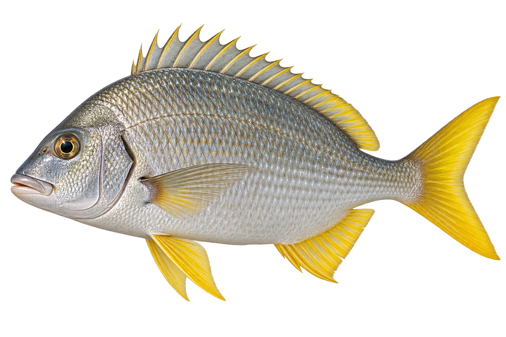

# 黄鳍鲷

Acanthopagrus latus · 鱼 · 2026-10-07

以明确物种代表常用名称；插画是观察示意，不用来野外鉴定。 台湾来源的旧广泛分布未直接采用；澳大利亚同名旧记录与 A. morrisoni 混用，当前仅采用本页形态与栖所。

- **黄色的鳍**：它的胸鳍、腹鳍和臀鳍，可以呈鲜黄色。（VTH-AX-01）
- **河口与海岸**：它生活在沿岸沙泥底，也会进入河口。（VTH-AX-02）
- **吃小动物**：它会吃蠕虫、贝类、虾蟹和小鱼。（VTH-AX-03）

资料：[中央研究院／臺灣魚類資料庫](https://fishdb.sinica.edu.tw/taxon/382634-fishdb)。位置：Identification / Summary / Biology / Habitat / species account。

[事实表](../claims.json) · [配音脚本](../scripts/audio-v1.json) · [生成提示与原图索引](../../../design/content/v1/generation.json)

每卡一段介绍、三个点听。新卡没有设置未经标定的局部放大坐标。图为 AI 原创艺术示意，非鉴定照片；交付为 2D 插画及图鉴内容，不代表新增三维捕获物种。
