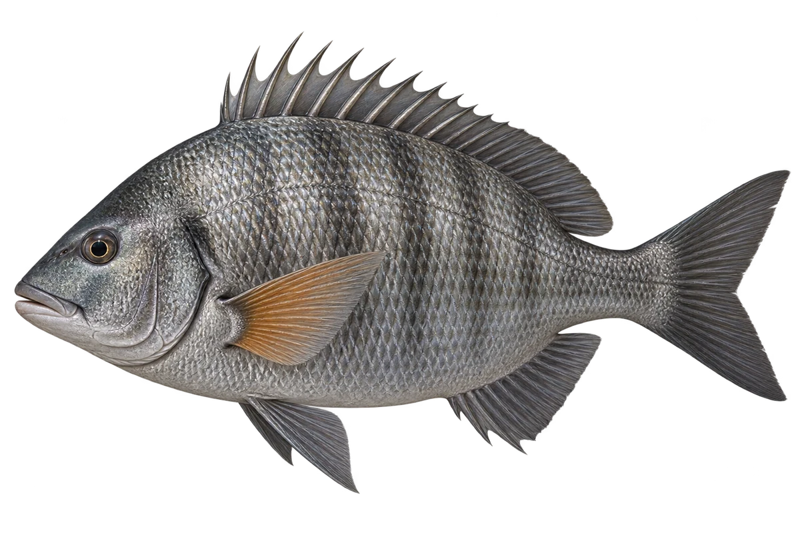

# 黑棘鲷 · 内容包 v1

2026-10-06 · Acanthopagrus schlegelii · 主要制作：主代理亲自完成。

## 观察与自由创作

孩子入口：这条鱼灰灰的，胸鳍却是橘黄色的。

给灰色的鱼，加一块你喜欢的亮色。

| 点听 | 短句 | 事实依据 |
| --- | --- | --- |
| 橘色胸鳍 | 看看身体侧边的鳍，是橘黄色的。 | AS-01 |
| 分叉尾巴 | 尾巴分成了上下两边。 | AS-02 |
| 海湾与河口 | 它也会生活在海湾和河口。 | AS-03 |

不是答题关卡。创作不要求与真实鱼一致；不同嘴、鳍、身体和花纹可以自由组合。

## 亲子解释与证据范围

黑棘鲷沿用项目中文名；台湾资料使用黑鲷。只展示来源支持的特征，不把性转变简化为每个个体必然发生。

本页事实引用 [claims.json](../claims.json)：AS-01、AS-02、AS-03。

- [中央研究院生物多樣性研究中心／臺灣魚類資料庫：Acanthopagrus schlegelii](https://catalog.digitalarchives.tw/item/00/42/6e/36.html)

中文短名是孩子入口称呼，正式中文名为项目称呼或工作名；以学名明确对象，未统一认证所有地区俗名。艺术图不是照片，也不是精细分类检索图。

## 已制作素材

- [PNG 原始插画](../../../design/content/v1/illustrations/acanthopagrus-schlegelii.png)
- [WebP 透明展示图](../../../public/content/v1/illustrations/acanthopagrus-schlegelii.webp)
- [短介绍音频](../../../public/content/v1/audio/vo-as-intro.wav)；另有 3 段点听音频，见 [脚本登记](../scripts/audio-v1.json)。
- [互动预览](../../../public/content/v1/index.html) 包含局部编号、重听、停止和亲子来源展开。

成品用于素材评审和接入准备。声音为系统合成试听，正式分发的声音授权单列；鱼的真实泳姿、精细三维结构和原目录全部历史行为仍不因插画完成而自动认证。
