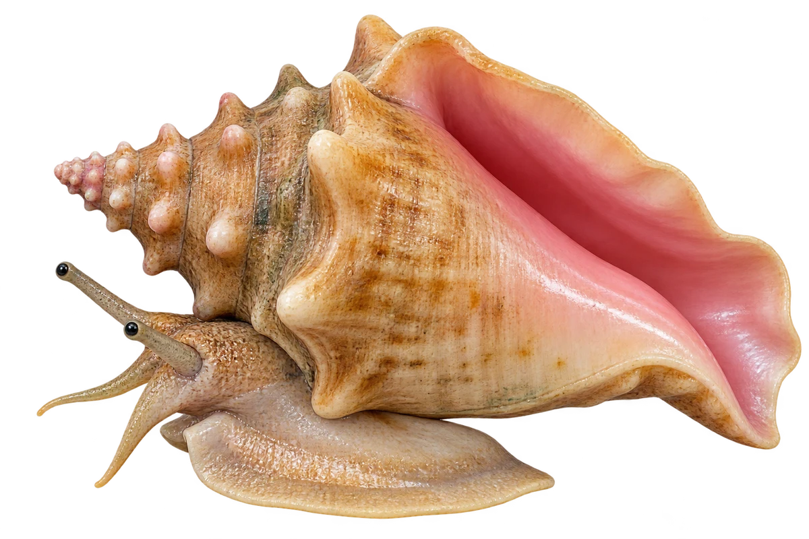

# 女王凤凰螺

Aliger gigas · 螺与鲍鱼 · 2026-10-07

中文食材俗名仅作生活联系；本卡以明确学名表示活体，不作为野外采集、鉴定或可食判断。

- **厚厚的螺壳**：成体有厚厚的螺壳，壳上还有短短的尖刺。（VTH-CY-01）
- **粉色壳口**：成体壳口里面常常是粉红色。（VTH-CY-02）
- **伸出来的眼睛**：两只眼睛长在可以活动的眼柄上。（VTH-CY-03）

资料：[NOAA Fisheries](https://www.fisheries.noaa.gov/species/queen-conch)。位置：Appearance。

[事实表](../claims.json) · [配音脚本](../scripts/audio-v1.json) · [生成提示与原图索引](../../../design/content/v1/generation.json)

每卡一段介绍、三个点听。新卡没有设置未经标定的局部放大坐标。图为 AI 原创艺术示意，非鉴定照片；交付为 2D 插画及图鉴内容，不代表新增三维捕获物种。
