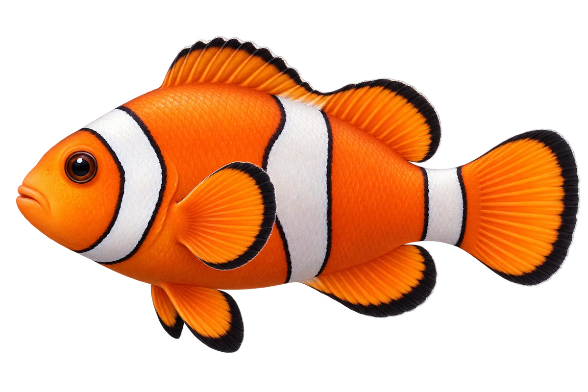

# 眼斑双锯鱼 · 内容包 v1

2026-10-06 · Amphiprion ocellaris · 主要制作：主代理亲自完成。

## 观察与自由创作

孩子入口：这是一条小丑鱼，看看它的白带。

你的鱼想画几条带子？也可以画成弯弯的。

| 点听 | 短句 | 事实依据 |
| --- | --- | --- |
| 三条白带 | 它的头、身体中间和尾根，各有一条白带。 | AO-02 |
| 鳍的颜色 | 看，它的鳍上还有黑色。 | AO-02 |
| 海葵伙伴 | 这种小丑鱼，会和这种海葵一起生活。 | AO-03、RM-01 |

不是答题关卡。创作不要求与真实鱼一致；不同嘴、鳍、身体和花纹可以自由组合。

## 亲子解释与证据范围

这里画的是常见橙色型。海葵配对只指本页的明确物种；不是所有鱼都能进入所有海葵。

本页事实引用 [claims.json](../claims.json)：AO-01、AO-02、AO-03、RM-01、AO-04。

- [WoRMS：Amphiprion ocellaris / AphiaID 278400](https://www.marinespecies.org/aphia.php?id=278400&p=taxdetails)
- [Australian Museum / Mark McGrouther：Western Clown Anemonefish](https://australian.museum/learn/animals/fishes/western-clown-anemonefish-amphiprion-ocellaris-cuvier-1830/)
- [Florida Museum：Clown Anemonefish](https://www.floridamuseum.ufl.edu/discover-fish/species-profiles/clown-anemonefish/)
- [WoRMS / World List of Actiniaria：Heteractis magnifica / AphiaID 290090](https://www.marinespecies.org/aphia.php?id=290090&p=taxdetails)
- [WoRMS Actiniaria / ReefLifeApps.com：Heteractis magnifica2 DMS / image 132841](https://marinespecies.org/Actiniaria/aphia.php?p=image&pic=132841&tid=290090)

中文短名是孩子入口称呼，正式中文名为项目称呼或工作名；以学名明确对象，未统一认证所有地区俗名。艺术图不是照片，也不是精细分类检索图。

## 已制作素材

- [PNG 原始插画](../../../design/content/v1/illustrations/amphiprion-ocellaris.png)
- [WebP 透明展示图](../../../public/content/v1/illustrations/amphiprion-ocellaris.webp)
- [短介绍音频](../../../public/content/v1/audio/vo-ao-intro.wav)；另有 3 段点听音频，见 [脚本登记](../scripts/audio-v1.json)。
- [互动预览](../../../public/content/v1/index.html) 包含局部编号、重听、停止和亲子来源展开。

成品用于素材评审和接入准备。声音为系统合成试听，正式分发的声音授权单列；鱼的真实泳姿、精细三维结构和原目录全部历史行为仍不因插画完成而自动认证。
