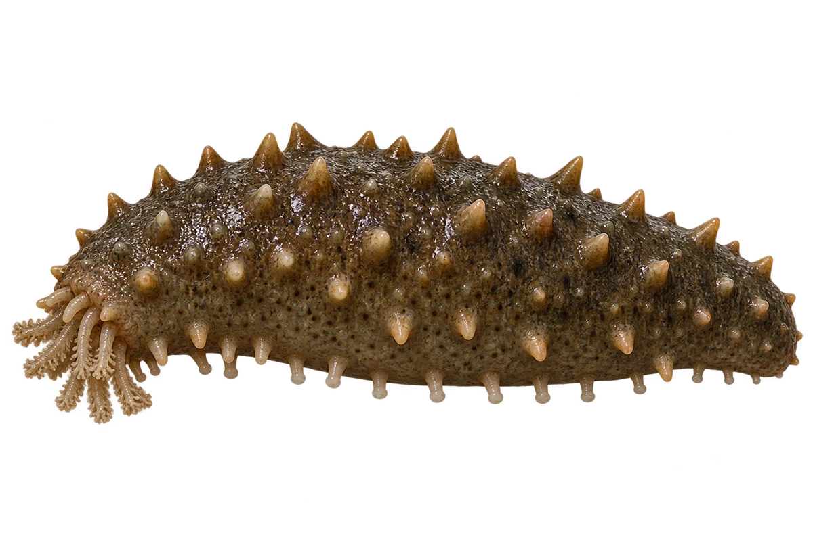

# 仿刺参（海参）

Apostichopus japonicus · 其他伙伴 · 2026-10-07

中文食材俗名仅作生活联系；本卡以明确学名表示活体，不作为野外采集、鉴定或可食判断。

- **软软的长身体**：身体长长的，背上有锥形小突起。（VTH-DI-01）
- **下面的小管足**：身体下面有一排排小管足。（VTH-DI-02）
- **颜色会不同**：不同个体可以是绿色、褐色或灰色。（VTH-DI-03）

资料：[FAO 联合国粮农组织](https://www.fao.org/4/i1918e/i1918e.pdf)。位置：Apostichopus japonicus species account。

[事实表](../claims.json) · [配音脚本](../scripts/audio-v1.json) · [生成提示与原图索引](../../../design/content/v1/generation.json)

每卡一段介绍、三个点听。新卡没有设置未经标定的局部放大坐标。图为 AI 原创艺术示意，非鉴定照片；交付为 2D 插画及图鉴内容，不代表新增三维捕获物种。
