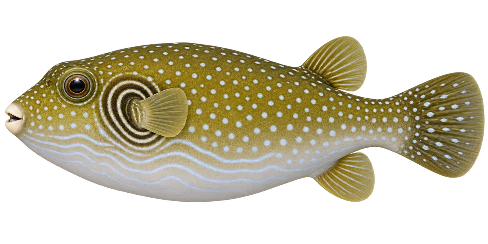

# 纹腹叉鼻鲀 · 内容包 v1

2026-10-06 · Arothron hispidus · 主要制作：主代理亲自完成。

## 观察与自由创作

孩子入口：这条鱼圆圆的，身上有点点和线条。

上面画点点，下面画线条，或者换一种你喜欢的组合。

| 点听 | 短句 | 事实依据 |
| --- | --- | --- |
| 点点与线条 | 上面是白点，下面是浅色线条。 | AH-01 |
| 深浅圆环 | 看胸鳍根部，一圈深，一圈浅。 | AH-02 |
| 小小的喙 | 它的嘴，像一个小喙。 | AH-04 |

不是答题关卡。创作不要求与真实鱼一致；不同嘴、鳍、身体和花纹可以自由组合。

## 亲子解释与证据范围

展示正常未膨胀状态。花纹与嘴形有证据；“气囊”旧说法不进入新内容，不靠画面推断游速或膨胀机制。

本页事实引用 [claims.json](../claims.json)：AH-01、AH-03、AH-02、AH-04、AH-05。

- [Australian Museum / Mark McGrouther：Stars-and-stripes Puffer](https://australian.museum/learn/animals/fishes/stars-and-stripes-toadfish-arothron-hispidus-linnaeus-1758/)

中文短名是孩子入口称呼，正式中文名为项目称呼或工作名；以学名明确对象，未统一认证所有地区俗名。艺术图不是照片，也不是精细分类检索图。

## 已制作素材

- [PNG 原始插画](../../../design/content/v1/illustrations/arothron-hispidus.png)
- [WebP 透明展示图](../../../public/content/v1/illustrations/arothron-hispidus.webp)
- [短介绍音频](../../../public/content/v1/audio/vo-ah-intro.wav)；另有 3 段点听音频，见 [脚本登记](../scripts/audio-v1.json)。
- [互动预览](../../../public/content/v1/index.html) 包含局部编号、重听、停止和亲子来源展开。

成品用于素材评审和接入准备。声音为系统合成试听，正式分发的声音授权单列；鱼的真实泳姿、精细三维结构和原目录全部历史行为仍不因插画完成而自动认证。
