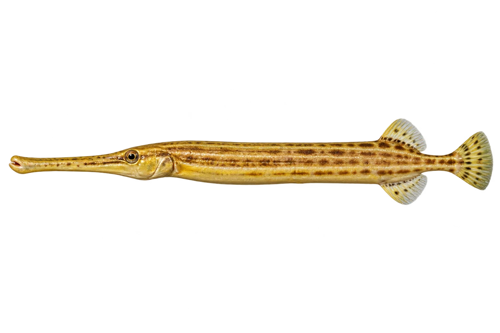

# 中国管口鱼

Aulostomus chinensis · 鱼 · 2026-10-07

细长管状嘴是识别重点。

- **管子一样的嘴**：它身体细长，嘴也像一根小管子。（VTH-AM-01）
- **颜色能变化**：这种鱼有褐色、绿色和黄色等色型，还能改变颜色。（VTH-AM-02）
- **珊瑚礁伙伴**：它生活在珊瑚礁附近。（VTH-AM-03）

资料：[Australian Museum](https://australian.museum/learn/animals/fishes/trumpetfish-aulostomus-chinensis-linnaeus-1766/)。位置：Identification / Summary / Biology / Habitat / species account。

[事实表](../claims.json) · [配音脚本](../scripts/audio-v1.json) · [生成提示与原图索引](../../../design/content/v1/generation.json)

每卡一段介绍、三个点听。新卡没有设置未经标定的局部放大坐标。图为 AI 原创艺术示意，非鉴定照片；交付为 2D 插画及图鉴内容，不代表新增三维捕获物种。
