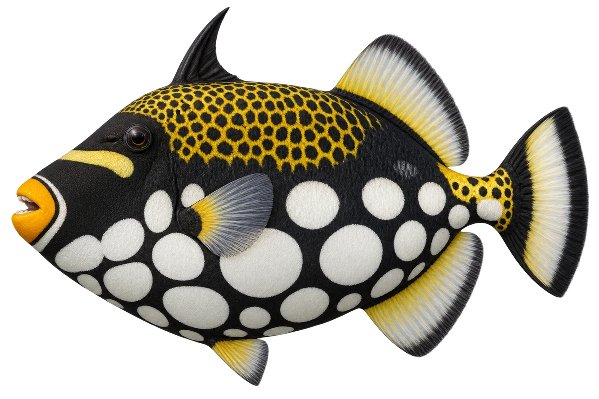

# 花纹鳞鲀

Balistoides conspicillum · 鱼 · 2026-10-07

白点和黄色区域的位置是观察重点。

- **黑底大白点**：它身体下半部的黑色底上，有很大的白色圆点。（VTH-AJ-01）
- **上面是网纹**：背部还有黄白色的网状花纹。（VTH-AJ-02）
- **橙色嘴唇**：它的嘴唇周围有橙色，尾根有浅色带子。（VTH-AJ-03）

资料：[Museums Victoria / Fishes of Australia](https://fishesofaustralia.net.au/home/species/761)。位置：Identification / Summary / Biology / Habitat / species account。

[事实表](../claims.json) · [配音脚本](../scripts/audio-v1.json) · [生成提示与原图索引](../../../design/content/v1/generation.json)

每卡一段介绍、三个点听。新卡没有设置未经标定的局部放大坐标。图为 AI 原创艺术示意，非鉴定照片；交付为 2D 插画及图鉴内容，不代表新增三维捕获物种。
