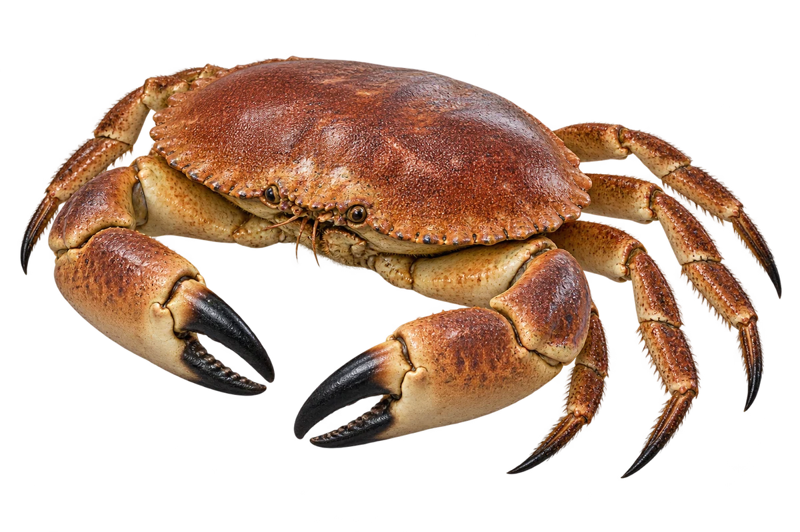

# 黄道蟹（面包蟹）

Cancer pagurus · 蟹 · 2026-10-07

中文食材俗名仅作生活联系；本卡以明确学名表示活体，不作为野外采集、鉴定或可食判断。

- **饼边一样的壳**：椭圆的厚壳，边缘像一圈小波浪。（VTH-CK-01）
- **黑色螯尖**：大螯的尖端是深色的。（VTH-CK-02）
- **海底找家**：可以生活在岩石附近，也能在泥沙底活动。（VTH-CK-03）

资料：[Marine Biological Association / MarLIN](https://www.marlin.ac.uk/species/detail/1179)。位置：Description / Habitat。

[事实表](../claims.json) · [配音脚本](../scripts/audio-v1.json) · [生成提示与原图索引](../../../design/content/v1/generation.json)

每卡一段介绍、三个点听。新卡没有设置未经标定的局部放大坐标。图为 AI 原创艺术示意，非鉴定照片；交付为 2D 插画及图鉴内容，不代表新增三维捕获物种。
