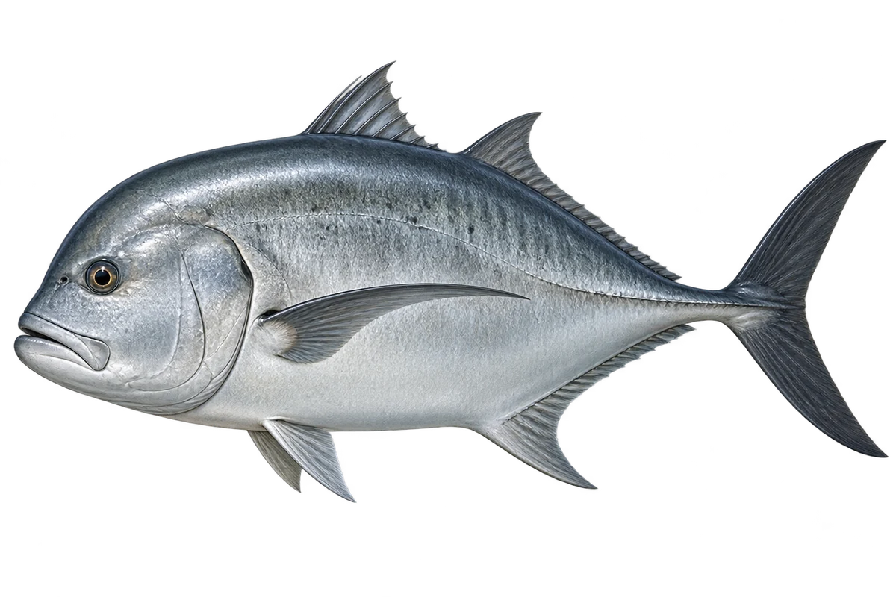

# GT 大鲹 · 内容包 v1

2026-10-06 · Caranx ignobilis · 主要制作：主代理亲自完成。

## 观察与自由创作

孩子入口：这是大鲹，钓鱼的人也叫它 GT。

给你的鱼画一个陡陡的额头，再试试平一点的。

| 点听 | 短句 | 事实依据 |
| --- | --- | --- |
| 陡陡的额头 | 看看额头，陡陡的。 | CI-01 |
| 银色的身体 | 它可以是银色，也可以更深。 | CI-02 |
| 硬硬的小鳞 | 身体侧面后半段，还有一排硬硬的小鳞。 | CI-03 |

不是答题关卡。创作不要求与真实鱼一致；不同嘴、鳍、身体和花纹可以自由组合。

## 亲子解释与证据范围

GT 是英文俗名 Giant Trevally 的简称。选择银色成鱼示意；强壮外形不自动转成孩子必须更难的操作。

本页事实引用 [claims.json](../claims.json)：CI-01、CI-02、CI-03。

- [Museums Victoria / Fishes of Australia：Giant Trevally](https://fishesofaustralia.net.au/home/species/4268)

中文短名是孩子入口称呼，正式中文名为项目称呼或工作名；以学名明确对象，未统一认证所有地区俗名。艺术图不是照片，也不是精细分类检索图。

## 已制作素材

- [PNG 原始插画](../../../design/content/v1/illustrations/caranx-ignobilis.png)
- [WebP 透明展示图](../../../public/content/v1/illustrations/caranx-ignobilis.webp)
- [短介绍音频](../../../public/content/v1/audio/vo-ci-intro.wav)；另有 3 段点听音频，见 [脚本登记](../scripts/audio-v1.json)。
- [互动预览](../../../public/content/v1/index.html) 包含局部编号、重听、停止和亲子来源展开。

成品用于素材评审和接入准备。声音为系统合成试听，正式分发的声音授权单列；鱼的真实泳姿、精细三维结构和原目录全部历史行为仍不因插画完成而自动认证。
