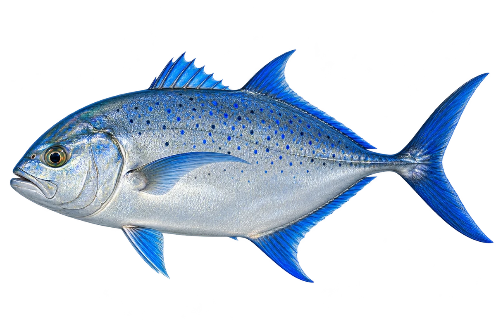

# 蓝鳍鲹

Caranx melampygus · 鱼 · 2026-10-07

以明确物种代表常用名称；插画是观察示意，不用来野外鉴定。

- **蓝色的鳍**：成鱼的鳍带着漂亮的蓝色。（VTH-BD-01）
- **蓝黑色小点**：成鱼身体两侧，有蓝色和黑色的小点。（VTH-BD-02）
- **礁区伙伴**：它会在礁区、礁湖和水道活动。（VTH-BD-03）

资料：[Museums Victoria / Fishes of Australia](https://fishesofaustralia.net.au/home/species/1652)。位置：Identification / Summary / Biology / Habitat / species account。

[事实表](../claims.json) · [配音脚本](../scripts/audio-v1.json) · [生成提示与原图索引](../../../design/content/v1/generation.json)

每卡一段介绍、三个点听。新卡没有设置未经标定的局部放大坐标。图为 AI 原创艺术示意，非鉴定照片；交付为 2D 插画及图鉴内容，不代表新增三维捕获物种。
