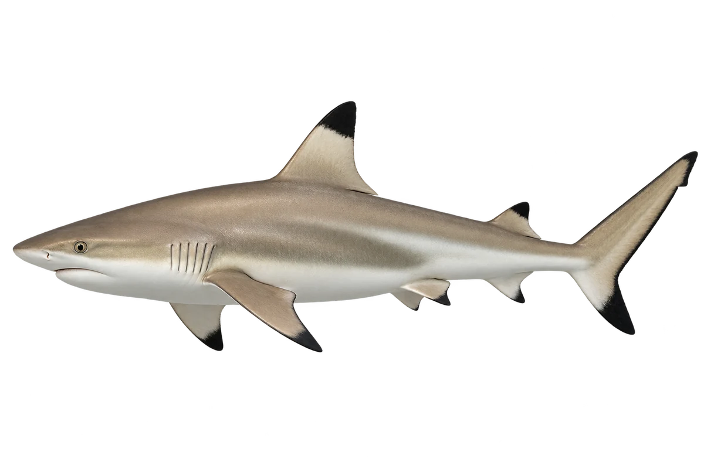

# 黑鳍礁鲨

Carcharhinus melanopterus · 鱼 · 2026-10-07

鲨鱼属于鱼；不是本轮普通钓鱼池。

- **鳍尖是黑的**：它第一片背鳍和尾巴下叶，末端是黑色的。（VTH-AR-01）
- **浅海礁区**：它常在珊瑚礁附近的浅海活动。（VTH-AR-02）
- **鲨鱼也是鱼**：它属于软骨鱼类，也是海里的鱼。（VTH-AR-03）

资料：[Australian Museum](https://australian.museum/learn/animals/fishes/blacktip-reef-shark-carcharhinus-melanopterus-quoy-gaimard-1824/)。位置：Identification / Summary / Biology / Habitat / species account。

[事实表](../claims.json) · [配音脚本](../scripts/audio-v1.json) · [生成提示与原图索引](../../../design/content/v1/generation.json)

每卡一段介绍、三个点听。新卡没有设置未经标定的局部放大坐标。图为 AI 原创艺术示意，非鉴定照片；交付为 2D 插画及图鉴内容，不代表新增三维捕获物种。
