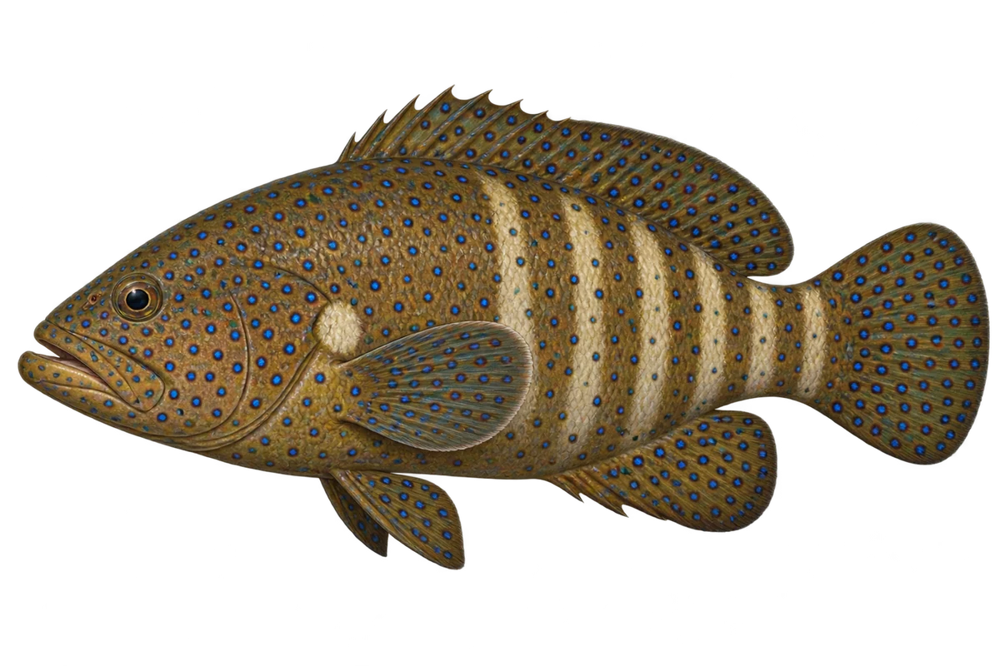

# 蓝点石斑 · 内容包 v1

2026-10-06 · Cephalopholis argus · 主要制作：主代理亲自完成。

## 观察与自由创作

孩子入口：这条褐色的石斑鱼，也有蓝点。

同样的蓝点，放在红色和褐色上，有什么不同？

| 点听 | 短句 | 事实依据 |
| --- | --- | --- |
| 有深边的蓝点 | 蓝点外面，还有一圈深色边。 | CA-01 |
| 胸鳍前的浅色 | 胸鳍前面，有一片浅色。 | CA-02 |
| 淡淡的带子 | 有时候，身体后面还有浅色带子。 | CA-03 |

不是答题关卡。创作不要求与真实鱼一致；不同嘴、鳍、身体和花纹可以自由组合。

## 亲子解释与证据范围

蓝点石斑为工作名，仅对应 C. argus。画选绿褐底色、淡后部带纹；条带显现有条件。与红色东星斑分开比较。

本页事实引用 [claims.json](../claims.json)：CA-01、CA-02、CA-03。

- [Australian Museum：Peacock Rockcod](https://australian.museum/learn/animals/fishes/peacock-rockcod-cephalopholis-argus-bloch-schneider-1801/)

中文短名是孩子入口称呼，正式中文名为项目称呼或工作名；以学名明确对象，未统一认证所有地区俗名。艺术图不是照片，也不是精细分类检索图。

## 已制作素材

- [PNG 原始插画](../../../design/content/v1/illustrations/cephalopholis-argus.png)
- [WebP 透明展示图](../../../public/content/v1/illustrations/cephalopholis-argus.webp)
- [短介绍音频](../../../public/content/v1/audio/vo-ca-intro.wav)；另有 3 段点听音频，见 [脚本登记](../scripts/audio-v1.json)。
- [互动预览](../../../public/content/v1/index.html) 包含局部编号、重听、停止和亲子来源展开。

成品用于素材评审和接入准备。声音为系统合成试听，正式分发的声音授权单列；鱼的真实泳姿、精细三维结构和原目录全部历史行为仍不因插画完成而自动认证。
