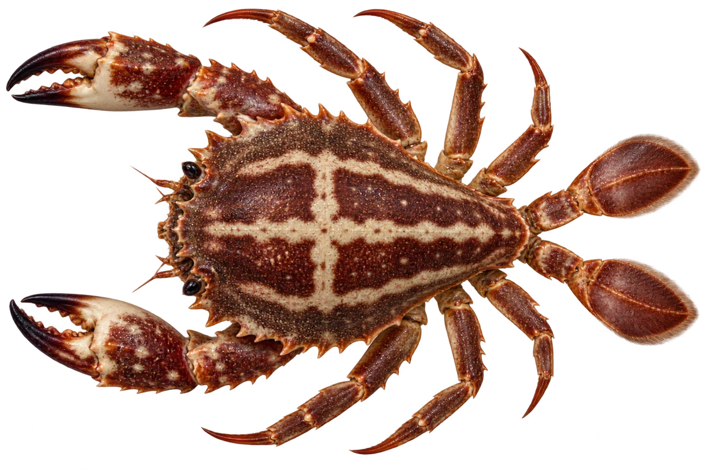

# 锈斑蟳（红花蟹）

Charybdis feriata · 蟹 · 2026-10-07

中文食材俗名仅作生活联系；本卡以明确学名表示活体，不作为野外采集、鉴定或可食判断。 FAO 历史资料拼写 Charybdis feriatus；目前使用 Charybdis feriata。

- **壳上的十字**：背壳中间，可以有浅色的十字图案。（VTH-CJ-01）
- **带纹的小脚**：腿和螯上可以看到深浅条带。（VTH-CJ-02）
- **会游泳的脚**：最后一对脚的末端是扁平的。（VTH-CJ-03）

资料：[FAO 联合国粮农组织](https://openknowledge.fao.org/server/api/core/bitstreams/f32d004b-6358-44f3-8242-b9d23e5346d0/content)、[WoRMS](https://www.marinespecies.org/aphia.php?id=1779697&p=taxdetails)。位置：Charybdis feriatus account; historical spelling feriatus。

[事实表](../claims.json) · [配音脚本](../scripts/audio-v1.json) · [生成提示与原图索引](../../../design/content/v1/generation.json)

每卡一段介绍、三个点听。新卡没有设置未经标定的局部放大坐标。图为 AI 原创艺术示意，非鉴定照片；交付为 2D 插画及图鉴内容，不代表新增三维捕获物种。
