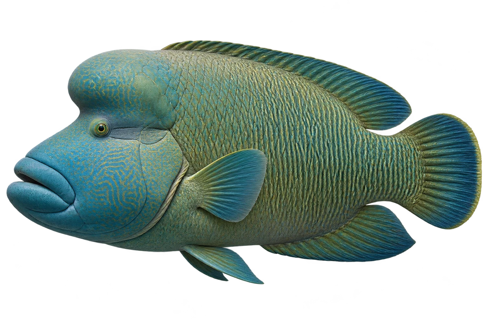

# 苏眉鱼

Cheilinus undulatus · 鱼 · 2026-10-07

额头隆起与色型对应较大成鱼，不代表幼鱼。

- **鼓鼓的额头**：成年苏眉鱼的额头鼓起来，嘴唇也厚厚的。（VTH-AG-01）
- **弯弯的线**：它身上有弯曲的线条，眼睛后面也有线。（VTH-AG-02）
- **吃海里小动物**：它会吃贝类、海胆、虾蟹和鱼。（VTH-AG-03）

资料：[Australian Museum](https://australian.museum/learn/animals/fishes/humphead-maori-wrasse-cheilinus-undulatus/)。位置：Identification / Summary / Biology / Habitat / species account。

[事实表](../claims.json) · [配音脚本](../scripts/audio-v1.json) · [生成提示与原图索引](../../../design/content/v1/generation.json)

每卡一段介绍、三个点听。新卡没有设置未经标定的局部放大坐标。图为 AI 原创艺术示意，非鉴定照片；交付为 2D 插画及图鉴内容，不代表新增三维捕获物种。
