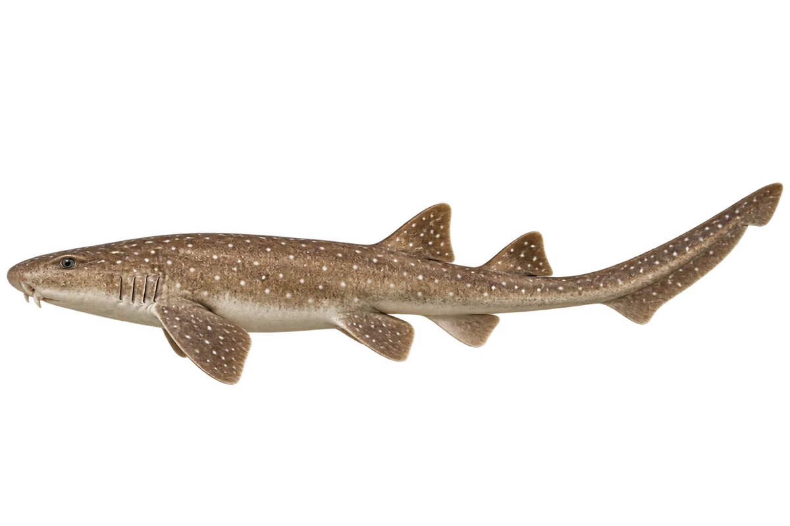

# 白斑竹鲨

Chiloscyllium plagiosum · 鱼 · 2026-10-07

以明确物种代表常用名称；插画是观察示意，不用来野外鉴定。

- **细长和白点**：它身体细长，褐色底上有深色带子和白点。（VTH-BV-01）
- **夜里的礁区**：它是喜欢夜间活动的礁区鲨鱼。（VTH-BV-02）
- **卵壳里的小鲨鱼**：这种鲨鱼会产卵，小鲨鱼在卵壳里发育后出来。（VTH-BV-03）

资料：[Florida Museum](https://www.floridamuseum.ufl.edu/discover-fish/species-profiles/whitespotted-bambooshark/)。位置：Identification / Summary / Biology / Habitat / species account。

[事实表](../claims.json) · [配音脚本](../scripts/audio-v1.json) · [生成提示与原图索引](../../../design/content/v1/generation.json)

每卡一段介绍、三个点听。新卡没有设置未经标定的局部放大坐标。图为 AI 原创艺术示意，非鉴定照片；交付为 2D 插画及图鉴内容，不代表新增三维捕获物种。
