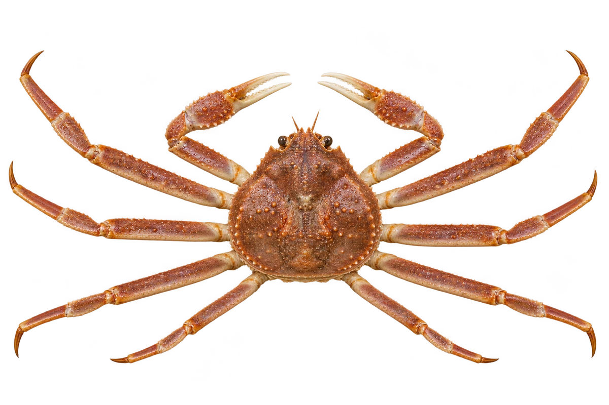

# 雪蟹

Chionoecetes opilio · 蟹 · 2026-10-07

中文食材俗名仅作生活联系；本卡以明确学名表示活体，不作为野外采集、鉴定或可食判断。

- **圆圆的背壳**：硬硬的背壳比较圆。（VTH-CL-01）
- **四对步行脚**：除了一对螯，还能看到四对步行脚。（VTH-CL-02）
- **上下颜色不同**：背面常是褐色，下面颜色较浅。（VTH-CL-03）

资料：[NOAA Fisheries](https://www.fisheries.noaa.gov/species/alaska-snow-crab)。位置：Appearance。

[事实表](../claims.json) · [配音脚本](../scripts/audio-v1.json) · [生成提示与原图索引](../../../design/content/v1/generation.json)

每卡一段介绍、三个点听。新卡没有设置未经标定的局部放大坐标。图为 AI 原创艺术示意，非鉴定照片；交付为 2D 插画及图鉴内容，不代表新增三维捕获物种。
