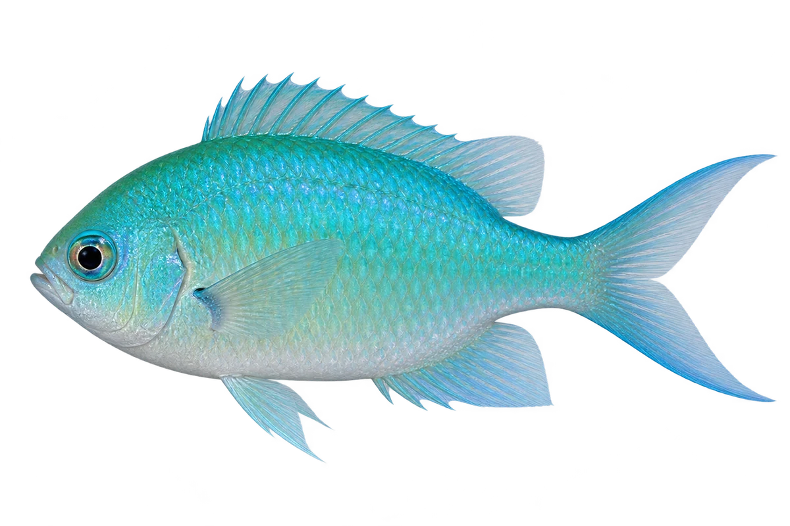

# 蓝绿雀鲷

Chromis viridis · 鱼 · 2026-10-07

蓝绿色的色泽受光线影响。

- **蓝绿闪光**：它的身体会闪出蓝色和绿色的光泽。（VTH-AI-01）
- **一起游**：它常常成群，在分枝的珊瑚附近活动。（VTH-AI-02）
- **细看鳍根**：这种蓝绿雀鲷的胸鳍根部，没有那种明显的黑斑。（VTH-AI-03）

资料：[Museums Victoria / Fishes of Australia](https://fishesofaustralia.net.au/home/species/329)。位置：Identification / Summary / Biology / Habitat / species account。

[事实表](../claims.json) · [配音脚本](../scripts/audio-v1.json) · [生成提示与原图索引](../../../design/content/v1/generation.json)

每卡一段介绍、三个点听。新卡没有设置未经标定的局部放大坐标。图为 AI 原创艺术示意，非鉴定照片；交付为 2D 插画及图鉴内容，不代表新增三维捕获物种。
