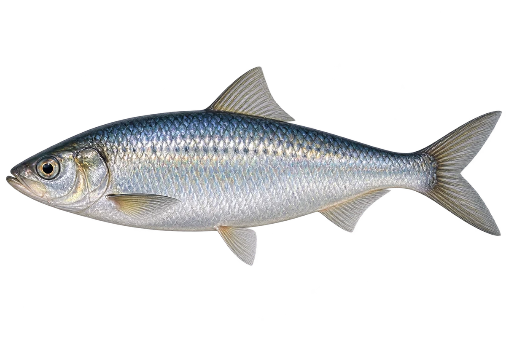

# 大西洋鲱

Clupea harengus · 鱼 · 2026-10-07

群游行为不由单张图证明。

- **银色小鱼**：它身体银亮，背部带蓝绿色。（VTH-AP-01）
- **成群一起游**：它们常常聚成鱼群，一起觅食和活动。（VTH-AP-02）
- **水里的小食物**：它会吃浮游动物和小型甲壳动物。（VTH-AP-03）

资料：[NOAA Fisheries](https://www.fisheries.noaa.gov/species/atlantic-herring)。位置：Identification / Summary / Biology / Habitat / species account。

[事实表](../claims.json) · [配音脚本](../scripts/audio-v1.json) · [生成提示与原图索引](../../../design/content/v1/generation.json)

每卡一段介绍、三个点听。新卡没有设置未经标定的局部放大坐标。图为 AI 原创艺术示意，非鉴定照片；交付为 2D 插画及图鉴内容，不代表新增三维捕获物种。
