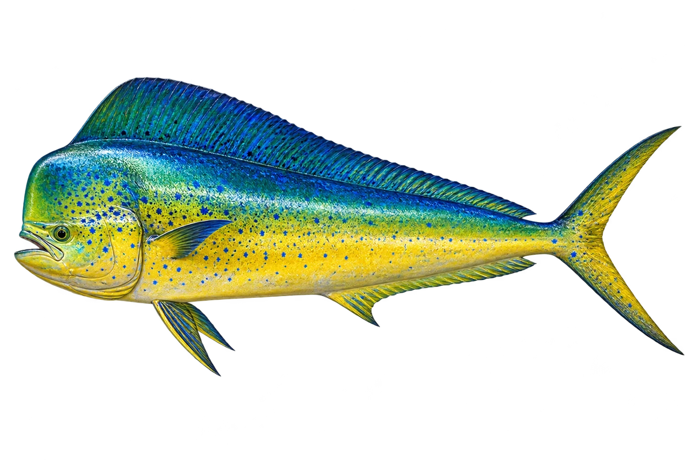

# 鲯鳅

Coryphaena hippurus · 鱼 · 2026-10-07

以明确物种代表常用名称；插画是观察示意，不用来野外鉴定。

- **蓝绿和金色**：它背部蓝绿色，身体下方带金色和银色。（VTH-BI-01）
- **额头不一样**：成年雄鱼额头较方，成年雌鱼额头较圆。（VTH-BI-02）
- **海面附近觅食**：它会在海面附近捕食小鱼和无脊椎动物。（VTH-BI-03）

资料：[NOAA Fisheries](https://www.fisheries.noaa.gov/species/atlantic-mahi-mahi)。位置：Identification / Summary / Biology / Habitat / species account。

[事实表](../claims.json) · [配音脚本](../scripts/audio-v1.json) · [生成提示与原图索引](../../../design/content/v1/generation.json)

每卡一段介绍、三个点听。新卡没有设置未经标定的局部放大坐标。图为 AI 原创艺术示意，非鉴定照片；交付为 2D 插画及图鉴内容，不代表新增三维捕获物种。
