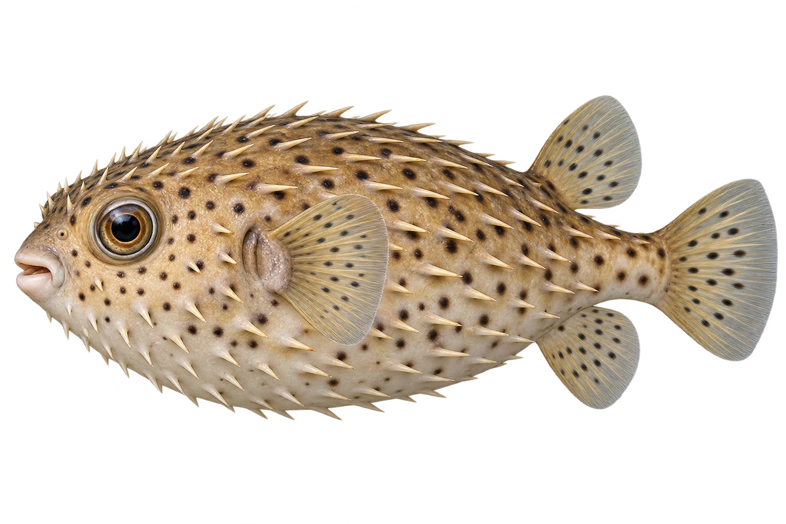

# 密斑刺鲀

Diodon hystrix · 鱼 · 2026-10-07

以明确物种代表常用名称；插画是观察示意，不用来野外鉴定。

- **点点和小棘**：它灰褐色身体和鳍上有黑点，身体有长棘。（VTH-BR-01）
- **遇险会鼓起**：遇到威胁时，它会吸水鼓起，棘也会竖起。（VTH-BR-02）
- **夜里找硬壳食物**：它常在夜里寻找海螺、寄居蟹和海胆。（VTH-BR-03）

资料：[Florida Museum](https://www.floridamuseum.ufl.edu/discover-fish/species-profiles/porcupinefish/)。位置：Identification / Summary / Biology / Habitat / species account。

[事实表](../claims.json) · [配音脚本](../scripts/audio-v1.json) · [生成提示与原图索引](../../../design/content/v1/generation.json)

每卡一段介绍、三个点听。新卡没有设置未经标定的局部放大坐标。图为 AI 原创艺术示意，非鉴定照片；交付为 2D 插画及图鉴内容，不代表新增三维捕获物种。
