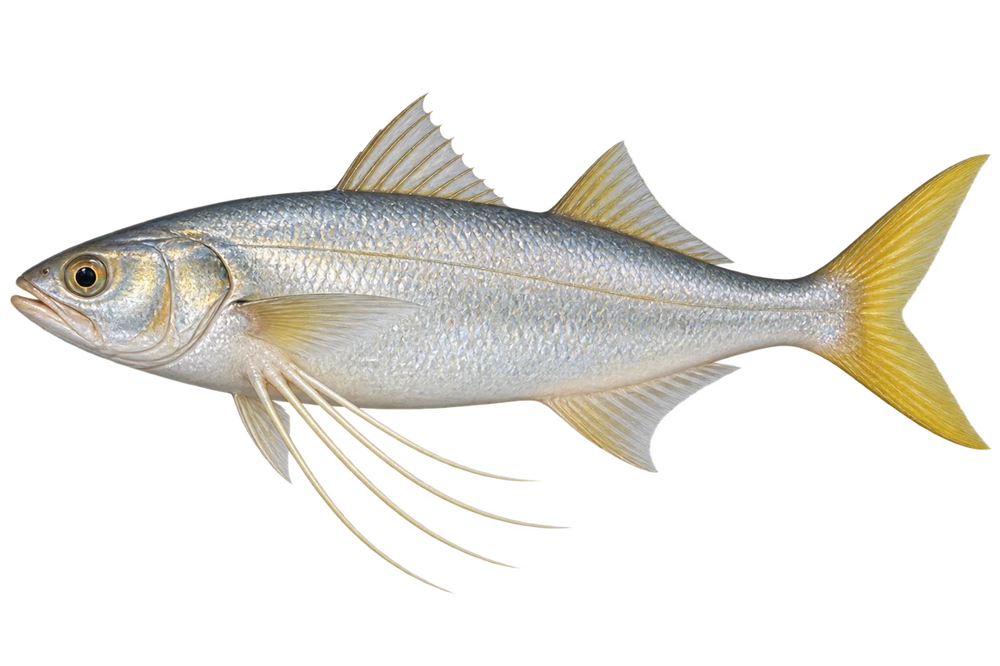

# 马友（四指马鲅）

Eleutheronema tetradactylum · 鱼 · 2026-10-07

以明确物种代表常用名称；插画是观察示意，不用来野外鉴定。

- **胸鳍下的细丝**：它每侧胸鳍下面，有四根分开的丝状鳍条。（VTH-BB-01）
- **两片背鳍**：它背上有两片分开的背鳍。（VTH-BB-02）
- **浅海和河口**：它可以生活在沿岸浅海和河口附近。（VTH-BB-03）

资料：[FAO 联合国粮农组织](https://www.fao.org/docrep/pdf/008/y5398e/y5398e03.pdf)。位置：pp17–18 / Eleutheronema tetradactylum。

[事实表](../claims.json) · [配音脚本](../scripts/audio-v1.json) · [生成提示与原图索引](../../../design/content/v1/generation.json)

每卡一段介绍、三个点听。新卡没有设置未经标定的局部放大坐标。图为 AI 原创艺术示意，非鉴定照片；交付为 2D 插画及图鉴内容，不代表新增三维捕获物种。
