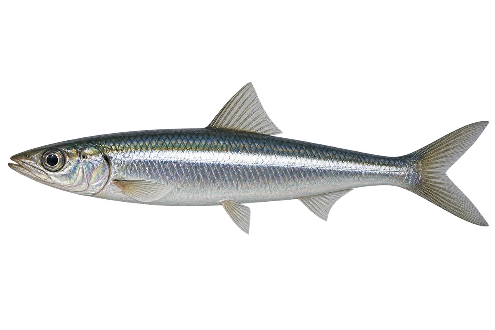

# 欧洲鳀鱼

Engraulis encrasicolus · 鱼 · 2026-10-07

以明确物种代表常用名称；插画是观察示意，不用来野外鉴定。

- **鼻子在嘴上方**：它的鼻子向前伸，嘴在鼻子下面，裂得较大。（VTH-BK-01）
- **成群的小鱼**：它们会形成大鱼群，在沿岸和河口活动。（VTH-BK-02）
- **欧洲鳀鱼**：这种鳀鱼分布在东大西洋和地中海等海域。（VTH-BK-03）

资料：[FAO 联合国粮农组织](https://www.fao.org/4/t8200f/T8200F16.htm)。位置：Identification / Summary / Biology / Habitat / species account。

[事实表](../claims.json) · [配音脚本](../scripts/audio-v1.json) · [生成提示与原图索引](../../../design/content/v1/generation.json)

每卡一段介绍、三个点听。新卡没有设置未经标定的局部放大坐标。图为 AI 原创艺术示意，非鉴定照片；交付为 2D 插画及图鉴内容，不代表新增三维捕获物种。
