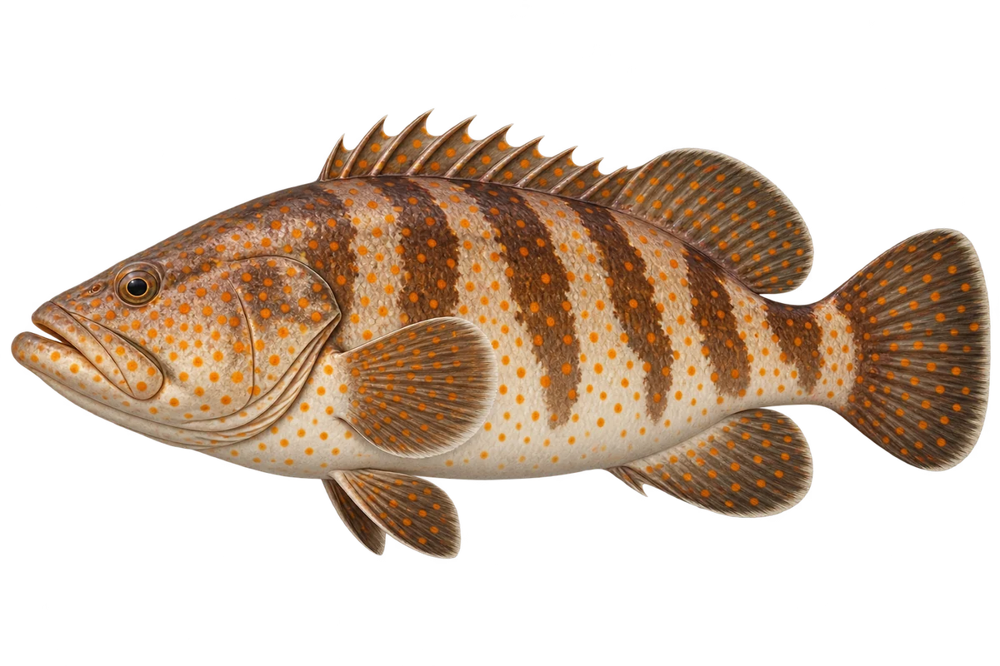

# 橙点石斑 · 内容包 v1

2026-10-06 · Epinephelus coioides · 主要制作：主代理亲自完成。

## 观察与自由创作

孩子入口：这条石斑鱼，穿着橙色点点的衣服。

你的鱼想穿圆点、斜带，还是两种都有？

| 点听 | 短句 | 事实依据 |
| --- | --- | --- |
| 橙色点点 | 身上有许多橙褐色小点。 | EC-01 |
| 斜斜的带子 | 身上还有斜斜的深色带子。 | EC-02 |
| 小时候的家 | 小鱼会住在河口。 | EC-03 |

不是答题关卡。创作不要求与真实鱼一致；不同嘴、鳍、身体和花纹可以自由组合。

## 亲子解释与证据范围

选择橙褐点成鱼示意；斑点相对大小随成长变化。来源英文 Cod 在这里指石斑，不是大西洋鳕。

本页事实引用 [claims.json](../claims.json)：EC-01、EC-02、EC-03。

- [Australian Museum：Goldspotted Rockcod](https://australian.museum/learn/animals/fishes/goldspotted-rockcod-epinephelus-coioides/)

中文短名是孩子入口称呼，正式中文名为项目称呼或工作名；以学名明确对象，未统一认证所有地区俗名。艺术图不是照片，也不是精细分类检索图。

## 已制作素材

- [PNG 原始插画](../../../design/content/v1/illustrations/epinephelus-coioides.png)
- [WebP 透明展示图](../../../public/content/v1/illustrations/epinephelus-coioides.webp)
- [短介绍音频](../../../public/content/v1/audio/vo-ec-intro.wav)；另有 3 段点听音频，见 [脚本登记](../scripts/audio-v1.json)。
- [互动预览](../../../public/content/v1/index.html) 包含局部编号、重听、停止和亲子来源展开。

成品用于素材评审和接入准备。声音为系统合成试听，正式分发的声音授权单列；鱼的真实泳姿、精细三维结构和原目录全部历史行为仍不因插画完成而自动认证。
