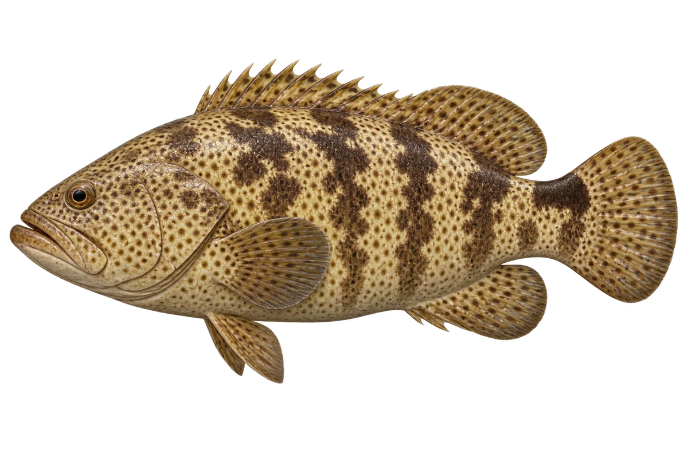

# 老虎斑 · 内容包 v1

2026-10-06 · Epinephelus fuscoguttatus · 主要制作：主代理亲自完成。

## 观察与自由创作

孩子入口：这条石斑鱼，身上是大斑和小点。

用大斑块和小点，设计一件花衣服吧。

| 点听 | 短句 | 事实依据 |
| --- | --- | --- |
| 大斑与小点 | 大块深色斑里，还有小小的点。 | EF-01 |
| 尾根的黑块 | 尾巴根部上面，有一块黑色。 | EF-02 |
| 小鱼与海草 | 小时候，它也会住在海草间。 | EF-03 |

不是答题关卡。创作不要求与真实鱼一致；不同嘴、鳍、身体和花纹可以自由组合。

## 亲子解释与证据范围

老虎斑为工作名；画的是 E. fuscoguttatus 成鱼近似色型，不能把市场商品名当成所有石斑的精确鉴定。

本页事实引用 [claims.json](../claims.json)：EF-01、EF-02、EF-03。

- [Museums Victoria / Fishes of Australia：Brown-marbled Grouper](https://fishesofaustralia.net.au/Home/species/4670)

中文短名是孩子入口称呼，正式中文名为项目称呼或工作名；以学名明确对象，未统一认证所有地区俗名。艺术图不是照片，也不是精细分类检索图。

## 已制作素材

- [PNG 原始插画](../../../design/content/v1/illustrations/epinephelus-fuscoguttatus.png)
- [WebP 透明展示图](../../../public/content/v1/illustrations/epinephelus-fuscoguttatus.webp)
- [短介绍音频](../../../public/content/v1/audio/vo-ef-intro.wav)；另有 3 段点听音频，见 [脚本登记](../scripts/audio-v1.json)。
- [互动预览](../../../public/content/v1/index.html) 包含局部编号、重听、停止和亲子来源展开。

成品用于素材评审和接入准备。声音为系统合成试听，正式分发的声音授权单列；鱼的真实泳姿、精细三维结构和原目录全部历史行为仍不因插画完成而自动认证。
