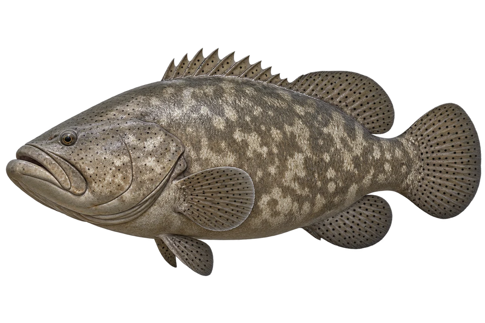

# 龙趸 · 内容包 v1

2026-10-06 · Epinephelus lanceolatus · 主要制作：主代理亲自完成。

## 观察与自由创作

孩子入口：这是一条大石斑，叫龙趸。

如果你的鱼长大换衣服，你想画哪两套？

| 点听 | 短句 | 事实依据 |
| --- | --- | --- |
| 大大的嘴 | 看看它的大嘴巴。 | EL-01 |
| 长大换衣服 | 小鱼黑黄相间，长大后颜色会变。 | EL-02 |
| 鳍上的黑点 | 它的鳍上，有很多小黑点。 | EL-03 |

不是答题关卡。创作不要求与真实鱼一致；不同嘴、鳍、身体和花纹可以自由组合。

## 亲子解释与证据范围

画的是成鱼灰褐示意，不混用幼鱼黑黄色。记录最大体型与常见体型是不同概念，此卡不让所有鱼都成为纪录巨鱼。

本页事实引用 [claims.json](../claims.json)：EL-01、EL-02、EL-03。

- [Australian Museum：Queensland Groper](https://australian.museum/learn/animals/fishes/queensland-groper-epinephelus-lanceolatus-bloch-1790/)

中文短名是孩子入口称呼，正式中文名为项目称呼或工作名；以学名明确对象，未统一认证所有地区俗名。艺术图不是照片，也不是精细分类检索图。

## 已制作素材

- [PNG 原始插画](../../../design/content/v1/illustrations/epinephelus-lanceolatus.png)
- [WebP 透明展示图](../../../public/content/v1/illustrations/epinephelus-lanceolatus.webp)
- [短介绍音频](../../../public/content/v1/audio/vo-el-intro.wav)；另有 3 段点听音频，见 [脚本登记](../scripts/audio-v1.json)。
- [互动预览](../../../public/content/v1/index.html) 包含局部编号、重听、停止和亲子来源展开。

成品用于素材评审和接入准备。声音为系统合成试听，正式分发的声音授权单列；鱼的真实泳姿、精细三维结构和原目录全部历史行为仍不因插画完成而自动认证。
