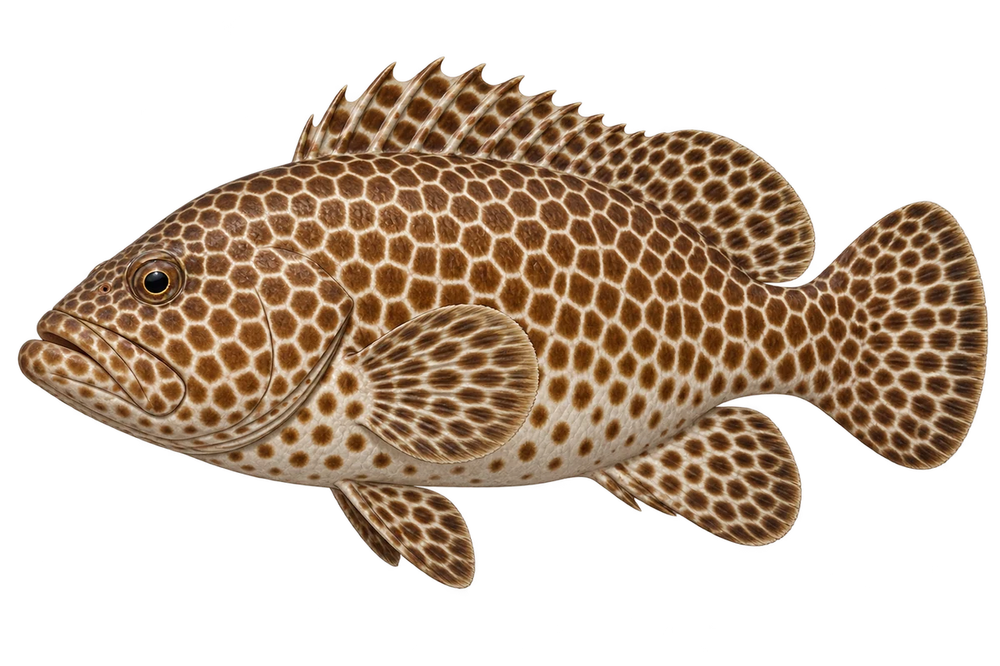

# 蜂窝石斑 · 内容包 v1

2026-10-06 · Epinephelus merra · 主要制作：主代理亲自完成。

## 观察与自由创作

孩子入口：看看它的花纹，像一片小蜂窝。

试试格子、拼图块，再留一些浅色缝隙。

| 点听 | 短句 | 事实依据 |
| --- | --- | --- |
| 蜂窝花纹 | 这些褐色花纹，像一个个小格子。 | EM-01 |
| 肚子上的间隔 | 到了肚子，点点之间的空隙更大。 | EM-02 |
| 圆圆的尾巴 | 尾巴的边，圆圆的。 | EM-03 |

不是答题关卡。创作不要求与真实鱼一致；不同嘴、鳍、身体和花纹可以自由组合。

## 亲子解释与证据范围

蜂窝石斑是工作名。小型石斑的蜂窝纹具有观察价值，但相似种仍需专业鉴定，不能只凭图认种。

本页事实引用 [claims.json](../claims.json)：EM-01、EM-02、EM-03。

- [Museums Victoria / Fishes of Australia：Honeycomb Grouper](https://fishesofaustralia.net.au/home/species/3848)

中文短名是孩子入口称呼，正式中文名为项目称呼或工作名；以学名明确对象，未统一认证所有地区俗名。艺术图不是照片，也不是精细分类检索图。

## 已制作素材

- [PNG 原始插画](../../../design/content/v1/illustrations/epinephelus-merra.png)
- [WebP 透明展示图](../../../public/content/v1/illustrations/epinephelus-merra.webp)
- [短介绍音频](../../../public/content/v1/audio/vo-em-intro.wav)；另有 3 段点听音频，见 [脚本登记](../scripts/audio-v1.json)。
- [互动预览](../../../public/content/v1/index.html) 包含局部编号、重听、停止和亲子来源展开。

成品用于素材评审和接入准备。声音为系统合成试听，正式分发的声音授权单列；鱼的真实泳姿、精细三维结构和原目录全部历史行为仍不因插画完成而自动认证。
