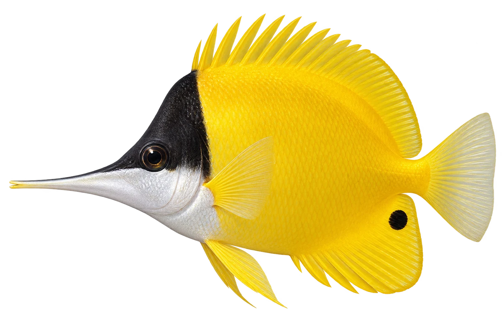

# 黄镊口鱼 · 内容包 v1

2026-10-06 · Forcipiger flavissimus · 主要制作：主代理亲自完成。

## 观察与自由创作

孩子入口：看，这条鱼有一张细长的嘴。

试着给你的鱼画一张长嘴，再试试短嘴。

| 点听 | 短句 | 事实依据 |
| --- | --- | --- |
| 长长的嘴 | 它会到珊瑚枝和礁缝里找食物。 | FF-03 |
| 鳍上的黑点 | 找找尾根下方的鳍，上面有一个黑点。 | FF-02 |
| 一起活动 | 它们常常两条一起，也会单独出现。 | FF-05 |

不是答题关卡。创作不要求与真实鱼一致；不同嘴、鳍、身体和花纹可以自由组合。

## 亲子解释与证据范围

长嘴与探礁缝取食有依据；并不代表所有长嘴鱼都吃同一种食物。黑点在臀鳍而非眼睛或尾鳍。

本页事实引用 [claims.json](../claims.json)：FF-01、FF-03、FF-02、FF-05、FF-04。

- [Australian Museum / Mark McGrouther：Forceps Fish](https://australian.museum/learn/animals/fishes/forceps-fish-forcipiger-flavissimus/)
- [Waikīkī Aquarium：Forceps Butterflyfish](https://www.waikikiaquarium.org/experience/animal-guide/fishes/butterflyfishes/forceps-butterflyfish/)

中文短名是孩子入口称呼，正式中文名为项目称呼或工作名；以学名明确对象，未统一认证所有地区俗名。艺术图不是照片，也不是精细分类检索图。

## 已制作素材

- [PNG 原始插画](../../../design/content/v1/illustrations/forcipiger-flavissimus.png)
- [WebP 透明展示图](../../../public/content/v1/illustrations/forcipiger-flavissimus.webp)
- [短介绍音频](../../../public/content/v1/audio/vo-ff-intro.wav)；另有 3 段点听音频，见 [脚本登记](../scripts/audio-v1.json)。
- [互动预览](../../../public/content/v1/index.html) 包含局部编号、重听、停止和亲子来源展开。

成品用于素材评审和接入准备。声音为系统合成试听，正式分发的声音授权单列；鱼的真实泳姿、精细三维结构和原目录全部历史行为仍不因插画完成而自动认证。
