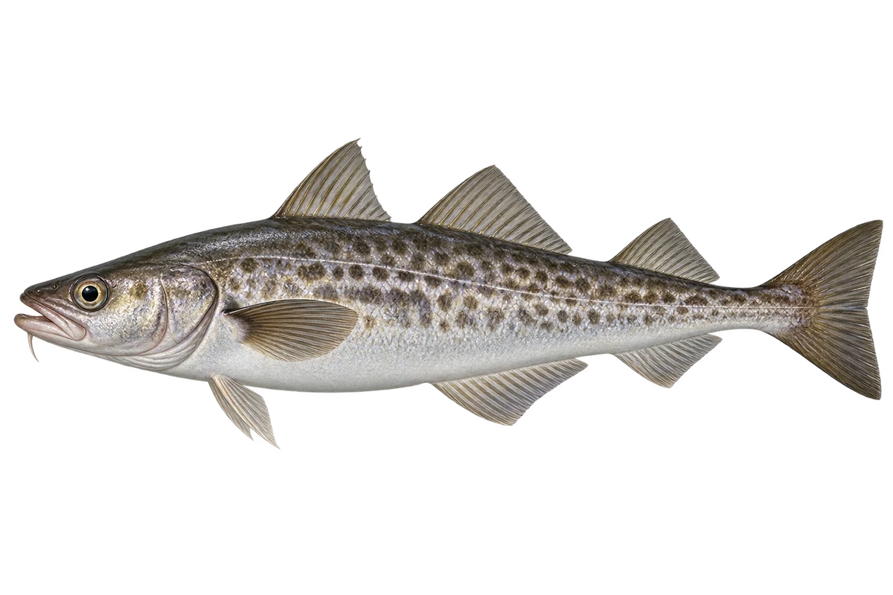

# 狭鳕

Gadus chalcogrammus · 鱼 · 2026-10-07

以明确物种代表常用名称；插画是观察示意，不用来野外鉴定。

- **身上的斑纹**：狭鳕属于鳕鱼家族，身体上有斑驳的花纹。（VTH-BN-01）
- **大小换水层**：幼鱼较常在水中层，大鱼更常接近海底。（VTH-BN-02）
- **冷海鱼群**：它们生活在北太平洋，常组成很大的鱼群。（VTH-BN-03）

资料：[NOAA Fisheries](https://www.fisheries.noaa.gov/species/alaska-pollock)。位置：Identification / Summary / Biology / Habitat / species account。

[事实表](../claims.json) · [配音脚本](../scripts/audio-v1.json) · [生成提示与原图索引](../../../design/content/v1/generation.json)

每卡一段介绍、三个点听。新卡没有设置未经标定的局部放大坐标。图为 AI 原创艺术示意，非鉴定照片；交付为 2D 插画及图鉴内容，不代表新增三维捕获物种。
