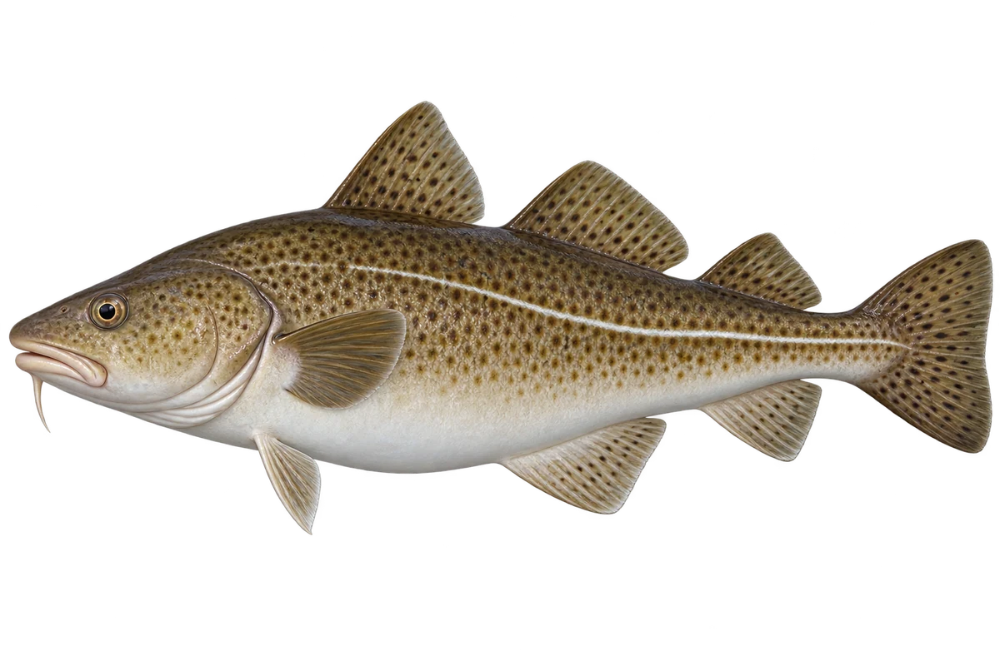

# 大西洋鳕 · 内容包 v1

2026-10-06 · Gadus morhua · 主要制作：主代理亲自完成。

## 观察与自由创作

孩子入口：这条鱼，叫大西洋鳕。看看下巴的小须。

给你的鱼画一根小须，再画一条身体侧面的线。

| 点听 | 短句 | 事实依据 |
| --- | --- | --- |
| 下巴的小须 | 下巴下面，有一根小小的须。 | GM-01 |
| 深点与浅肚子 | 身上有深色点，肚子却浅浅的。 | GM-02 |
| 身体上的线 | 身体侧面，还有一条长长的线。 | GM-03 |

不是答题关卡。创作不要求与真实鱼一致；不同嘴、鳍、身体和花纹可以自由组合。

## 亲子解释与证据范围

鳕鱼俗名不只一种。本卡明确为北大西洋 Gadus morhua；不能放进新加坡珊瑚礁并宣称当地自然分布。选择橄榄褐色示意。

本页事实引用 [claims.json](../claims.json)：GM-01、GM-02、GM-03。

- [NOAA Fisheries：Atlantic Cod](https://www.fisheries.noaa.gov/species/atlantic-cod)

中文短名是孩子入口称呼，正式中文名为项目称呼或工作名；以学名明确对象，未统一认证所有地区俗名。艺术图不是照片，也不是精细分类检索图。

## 已制作素材

- [PNG 原始插画](../../../design/content/v1/illustrations/gadus-morhua.png)
- [WebP 透明展示图](../../../public/content/v1/illustrations/gadus-morhua.webp)
- [短介绍音频](../../../public/content/v1/audio/vo-gm-intro.wav)；另有 3 段点听音频，见 [脚本登记](../scripts/audio-v1.json)。
- [互动预览](../../../public/content/v1/index.html) 包含局部编号、重听、停止和亲子来源展开。

成品用于素材评审和接入准备。声音为系统合成试听，正式分发的声音授权单列；鱼的真实泳姿、精细三维结构和原目录全部历史行为仍不因插画完成而自动认证。
