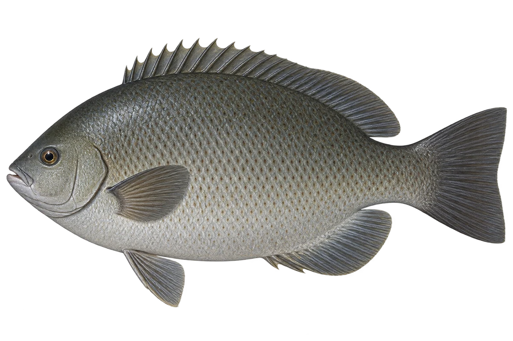

# 斑鱾 · 内容包 v1

2026-10-06 · Girella punctata · 主要制作：主代理亲自完成。

## 观察与自由创作

孩子入口：靠近看看，这条鱼身上有小黑点。

画一些很小的点，再画几个很大的点，看看有什么不同。

| 点听 | 短句 | 事实依据 |
| --- | --- | --- |
| 小小黑点 | 鳞片上，有小小的黑点。 | GP-01 |
| 胸鳍根部 | 胸鳍根部，还有一块深色斑。 | GP-02 |
| 吃些什么 | 它吃藻类，也吃一些小生物。 | GP-03 |

不是答题关卡。创作不要求与真实鱼一致；不同嘴、鳍、身体和花纹可以自由组合。

## 亲子解释与证据范围

台湾资料中文名为瓜子鱲，项目沿用斑鱾。食性季节变化属于该区域资料；不当成全球各地相同的季节规律。

本页事实引用 [claims.json](../claims.json)：GP-01、GP-02、GP-03。

- [中央研究院生物多樣性研究中心／臺灣魚類資料庫：Girella punctata](https://catalog.digitalarchives.tw/item/00/42/6b/6f.html)

中文短名是孩子入口称呼，正式中文名为项目称呼或工作名；以学名明确对象，未统一认证所有地区俗名。艺术图不是照片，也不是精细分类检索图。

## 已制作素材

- [PNG 原始插画](../../../design/content/v1/illustrations/girella-punctata.png)
- [WebP 透明展示图](../../../public/content/v1/illustrations/girella-punctata.webp)
- [短介绍音频](../../../public/content/v1/audio/vo-gp-intro.wav)；另有 3 段点听音频，见 [脚本登记](../scripts/audio-v1.json)。
- [互动预览](../../../public/content/v1/index.html) 包含局部编号、重听、停止和亲子来源展开。

成品用于素材评审和接入准备。声音为系统合成试听，正式分发的声音授权单列；鱼的真实泳姿、精细三维结构和原目录全部历史行为仍不因插画完成而自动认证。
