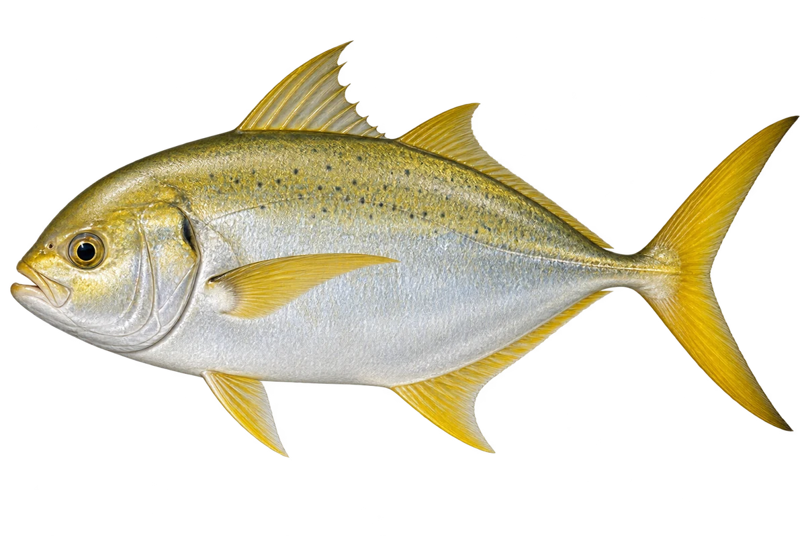

# 金鲹

Gnathanodon speciosus · 鱼 · 2026-10-07

成鱼和幼鱼花纹不同，图中选成鱼。

- **银色成鱼**：成鱼身体偏银灰色，鳍上可以带黄色。（VTH-AA-01）
- **小时候不同**：幼鱼是黄色的，身上有深色横带。（VTH-AA-02）
- **跟着大伙伴**：幼鱼有时跟在大鱼和海龟旁边活动。（VTH-AA-03）

资料：[Museums Victoria / Fishes of Australia](https://fishesofaustralia.net.au/home/species/4274)。位置：Identification / Summary / Biology / Habitat / species account。

[事实表](../claims.json) · [配音脚本](../scripts/audio-v1.json) · [生成提示与原图索引](../../../design/content/v1/generation.json)

每卡一段介绍、三个点听。新卡没有设置未经标定的局部放大坐标。图为 AI 原创艺术示意，非鉴定照片；交付为 2D 插画及图鉴内容，不代表新增三维捕获物种。
