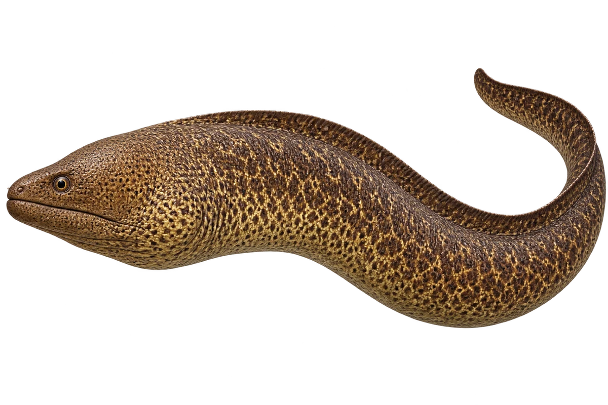

# 巨型裸胸鳝

Gymnothorax javanicus · 鱼 · 2026-10-07

长身体不是蛇，属于鱼。

- **长身和斑点**：它身体细长，褐色底上有深色斑点。（VTH-AK-01）
- **鳃口旁的黑块**：它鳃口附近有一块明显的黑色区域。（VTH-AK-02）
- **礁缝藏身**：它会待在珊瑚礁的洞、缝隙和岩檐下面。（VTH-AK-03）

资料：[Australian Museum](https://australian.museum/learn/animals/fishes/giant-moray-gymnothorax-javanicus-bleeker-1859/)。位置：Identification / Summary / Biology / Habitat / species account。

[事实表](../claims.json) · [配音脚本](../scripts/audio-v1.json) · [生成提示与原图索引](../../../design/content/v1/generation.json)

每卡一段介绍、三个点听。新卡没有设置未经标定的局部放大坐标。图为 AI 原创艺术示意，非鉴定照片；交付为 2D 插画及图鉴内容，不代表新增三维捕获物种。
