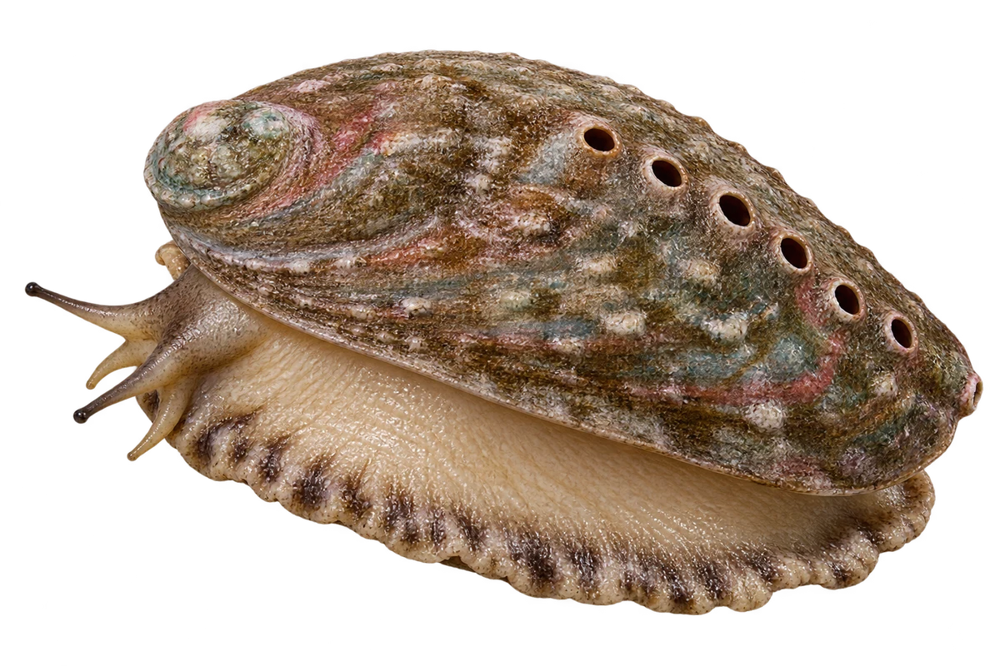

# 盘鲍（鲍鱼）

Haliotis discus · 螺与鲍鱼 · 2026-10-07

中文食材俗名仅作生活联系；本卡以明确学名表示活体，不作为野外采集、鉴定或可食判断。

- **耳朵形的壳**：一片扁扁的壳，轮廓像耳朵。（VTH-CU-01）
- **一排小孔**：壳边有一排小孔。（VTH-CU-02）
- **吃海藻**：鲍鱼可以吃海藻。（VTH-CU-03）

资料：[台湾政府机构／海洋与渔业资料](https://www.agriculture.ntpc.gov.tw/en/gongliao_abalone.html)。位置：Abalone species / shell / feeding。

[事实表](../claims.json) · [配音脚本](../scripts/audio-v1.json) · [生成提示与原图索引](../../../design/content/v1/generation.json)

每卡一段介绍、三个点听。新卡没有设置未经标定的局部放大坐标。图为 AI 原创艺术示意，非鉴定照片；交付为 2D 插画及图鉴内容，不代表新增三维捕获物种。
