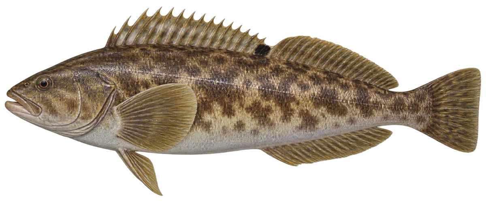

# 大泷六线鱼 · 内容包 v1

2026-10-06 · Hexagrammos otakii · 主要制作：主代理亲自完成。

## 观察与自由创作

孩子入口：看看这条鱼，身体长长的。

把你的鱼拉长一点，再试试短而圆的身体。

| 点听 | 短句 | 事实依据 |
| --- | --- | --- |
| 长长的身体 | 它的身体，比圆圆的鱼更长。 | HO-01 |
| 岩石海岸 | 它会住在岩石海岸。 | HO-02 |
| 守护鱼卵 | 鱼爸爸，会守护附在小石头上的卵。 | HO-03 |

不是答题关卡。创作不要求与真实鱼一致；不同嘴、鳍、身体和花纹可以自由组合。

## 亲子解释与证据范围

本批核对体形、岩岸栖所与雄鱼护卵；侧线数量和泳姿不从画面推断。它是温带物种，不称作新加坡本地鱼。

本页事实引用 [claims.json](../claims.json)：HO-01、HO-02、HO-03。

- [FishBase：Hexagrammos otakii](https://www.fishbase.se/summary/Hexagrammos-otakii.html)

中文短名是孩子入口称呼，正式中文名为项目称呼或工作名；以学名明确对象，未统一认证所有地区俗名。艺术图不是照片，也不是精细分类检索图。

## 已制作素材

- [PNG 原始插画](../../../design/content/v1/illustrations/hexagrammos-otakii.png)
- [WebP 透明展示图](../../../public/content/v1/illustrations/hexagrammos-otakii.webp)
- [短介绍音频](../../../public/content/v1/audio/vo-ho-intro.wav)；另有 3 段点听音频，见 [脚本登记](../scripts/audio-v1.json)。
- [互动预览](../../../public/content/v1/index.html) 包含局部编号、重听、停止和亲子来源展开。

成品用于素材评审和接入准备。声音为系统合成试听，正式分发的声音授权单列；鱼的真实泳姿、精细三维结构和原目录全部历史行为仍不因插画完成而自动认证。
