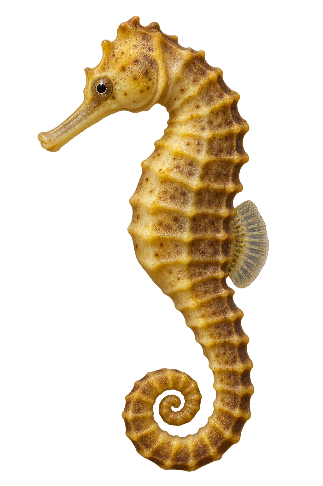

# 河口海马 · 内容包 v1

2026-10-06 · Hippocampus kuda · 主要制作：主代理亲自完成。

## 观察与自由创作

孩子入口：海马也是鱼，看它弯弯的尾巴。

画一条卷卷的尾巴，再选一个海草旁的家。

| 点听 | 短句 | 事实依据 |
| --- | --- | --- |
| 能抓住的尾巴 | 弯弯的尾巴，能抓住东西。 | HK-01 |
| 海草的家 | 这种海马，常住在河口附近的海草间。 | HK-02 |
| 爸爸的育儿袋 | 鱼爸爸，有一个装鱼卵的育儿袋。 | HK-03 |

不是答题关卡。创作不要求与真实鱼一致；不同嘴、鳍、身体和花纹可以自由组合。

## 亲子解释与证据范围

NParks 页面以 Hippocampus spp. 汇总，明确提到 H. kuda 河口海草栖所；育儿与抓握尾为海马类群知识。黄褐色是艺术选择，图不作相似海马的精确分类依据。

本页事实引用 [claims.json](../claims.json)：HK-01、HK-02、HK-03。

- [NParks Singapore：Seahorses / Estuarine Seahorse](https://www.nparks.gov.sg/florafaunaweb/fauna/3/0/305)

中文短名是孩子入口称呼，正式中文名为项目称呼或工作名；以学名明确对象，未统一认证所有地区俗名。艺术图不是照片，也不是精细分类检索图。

## 已制作素材

- [PNG 原始插画](../../../design/content/v1/illustrations/hippocampus-kuda.png)
- [WebP 透明展示图](../../../public/content/v1/illustrations/hippocampus-kuda.webp)
- [短介绍音频](../../../public/content/v1/audio/vo-hk-intro.wav)；另有 3 段点听音频，见 [脚本登记](../scripts/audio-v1.json)。
- [互动预览](../../../public/content/v1/index.html) 包含局部编号、重听、停止和亲子来源展开。

成品用于素材评审和接入准备。声音为系统合成试听，正式分发的声音授权单列；鱼的真实泳姿、精细三维结构和原目录全部历史行为仍不因插画完成而自动认证。
