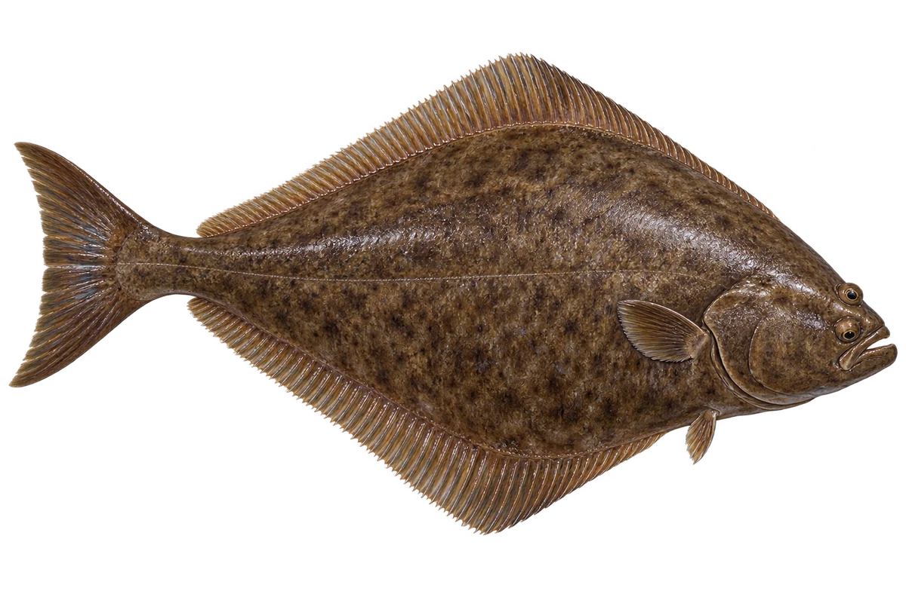

# 大西洋大比目鱼

Hippoglossus hippoglossus · 鱼 · 2026-10-07

以明确物种代表常用名称；插画是观察示意，不用来野外鉴定。

- **两眼在右边**：这种大比目鱼的两只眼睛，都在身体右侧。（VTH-BP-01）
- **北大西洋海底**：它生活在北大西洋的海底附近。（VTH-BP-02）
- **长大吃鱼**：幼鱼吃小型无脊椎动物，成鱼主要吃鱼。（VTH-BP-03）

资料：[NOAA Fisheries](https://www.fisheries.noaa.gov/species/atlantic-halibut)。位置：Identification / Summary / Biology / Habitat / species account。

[事实表](../claims.json) · [配音脚本](../scripts/audio-v1.json) · [生成提示与原图索引](../../../design/content/v1/generation.json)

每卡一段介绍、三个点听。新卡没有设置未经标定的局部放大坐标。图为 AI 原创艺术示意，非鉴定照片；交付为 2D 插画及图鉴内容，不代表新增三维捕获物种。
