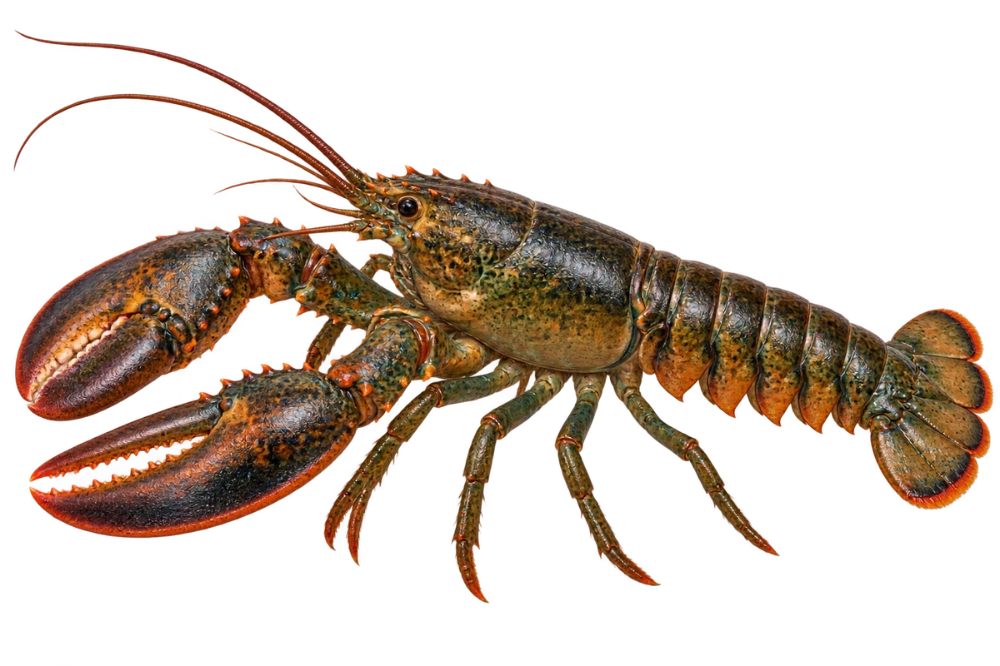

# 美洲螯龙虾

Homarus americanus · 虾与龙虾 · 2026-10-07

中文食材俗名仅作生活联系；本卡以明确学名表示活体，不作为野外采集、鉴定或可食判断。

- **一对大螯**：前面长着一对大大的钳子，叫作螯。（VTH-CG-01）
- **两螯不一样**：一个螯适合压碎食物，另一个适合撕开食物。（VTH-CG-02）
- **活体的颜色**：活着的时候，常常是绿褐色，并非鲜红色。（VTH-CG-03）

资料：[NOAA Fisheries](https://www.fisheries.noaa.gov/species/american-lobster)。位置：Appearance / Biology。

[事实表](../claims.json) · [配音脚本](../scripts/audio-v1.json) · [生成提示与原图索引](../../../design/content/v1/generation.json)

每卡一段介绍、三个点听。新卡没有设置未经标定的局部放大坐标。图为 AI 原创艺术示意，非鉴定照片；交付为 2D 插画及图鉴内容，不代表新增三维捕获物种。
