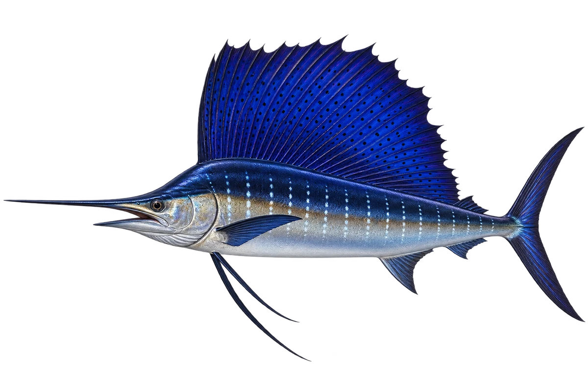

# 旗鱼

Istiophorus platypterus · 鱼 · 2026-10-07

以明确物种代表常用名称；插画是观察示意，不用来野外鉴定。

- **背上像风帆**：它的背鳍又高又长，像一面展开的帆。（VTH-BH-01）
- **细长的吻**：它的吻很长，横截面较圆，和剑鱼的扁剑不同。（VTH-BH-02）
- **吃鱼和鱿鱼**：它会在外海寻找小鱼和鱿鱼。（VTH-BH-03）

资料：[Museums Victoria / Fishes of Australia](https://fishesofaustralia.net.au/home/species/713)。位置：Identification / Summary / Biology / Habitat / species account。

[事实表](../claims.json) · [配音脚本](../scripts/audio-v1.json) · [生成提示与原图索引](../../../design/content/v1/generation.json)

每卡一段介绍、三个点听。新卡没有设置未经标定的局部放大坐标。图为 AI 原创艺术示意，非鉴定照片；交付为 2D 插画及图鉴内容，不代表新增三维捕获物种。
