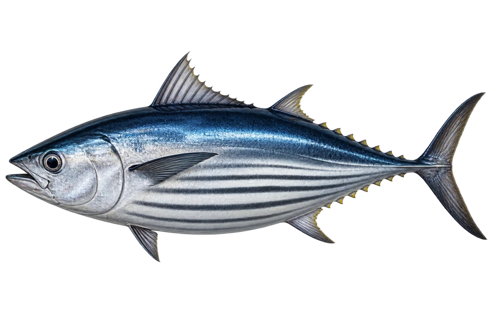

# 鲣鱼

Katsuwonus pelamis · 鱼 · 2026-10-07

以明确物种代表常用名称；插画是观察示意，不用来野外鉴定。

- **下方的长条纹**：它身体下半部，有四到六条深色纵向条纹。（VTH-BF-01）
- **温暖外海**：它主要生活在温暖海洋的开阔水域。（VTH-BF-02）
- **追着食物游**：它会吃鱼、虾蟹和头足类动物。（VTH-BF-03）

资料：[NOAA Fisheries](https://www.fisheries.noaa.gov/species/atlantic-skipjack-tuna)。位置：Identification / Summary / Biology / Habitat / species account。

[事实表](../claims.json) · [配音脚本](../scripts/audio-v1.json) · [生成提示与原图索引](../../../design/content/v1/generation.json)

每卡一段介绍、三个点听。新卡没有设置未经标定的局部放大坐标。图为 AI 原创艺术示意，非鉴定照片；交付为 2D 插画及图鉴内容，不代表新增三维捕获物种。
