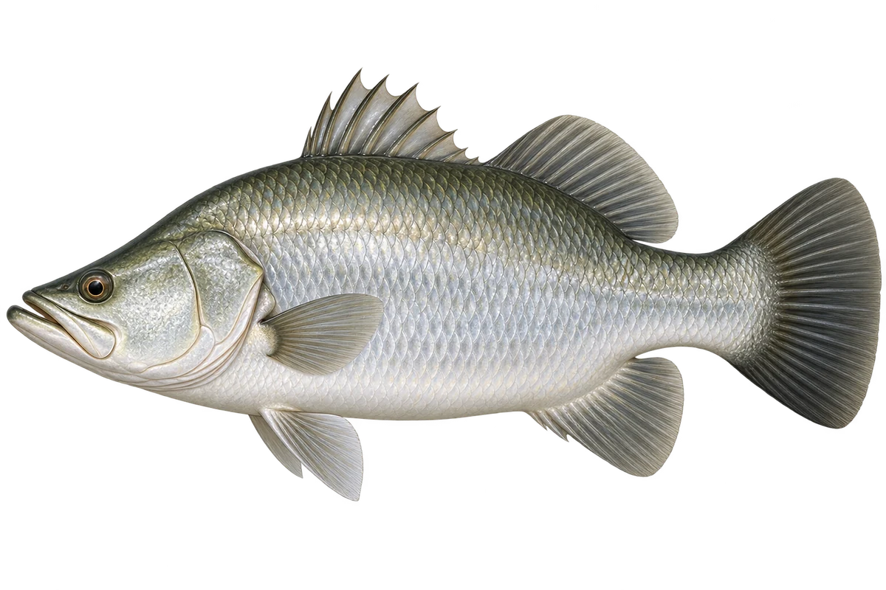

# 亚洲海鲈 · 内容包 v1

2026-10-06 · Lates calcarifer · 主要制作：主代理亲自完成。

## 观察与自由创作

孩子入口：这条银色的鱼，叫亚洲海鲈。

给你的鱼换一条圆尾巴，再试试分叉尾巴。

| 点听 | 短句 | 事实依据 |
| --- | --- | --- |
| 大嘴巴 | 它的嘴巴，一直伸到眼睛后面。 | LC-01 |
| 圆尾巴 | 看看尾巴，是圆圆的扇形。 | LC-02 |
| 河口与河流 | 它也能在河口和河流生活。 | LC-03 |

不是答题关卡。创作不要求与真实鱼一致；不同嘴、鳍、身体和花纹可以自由组合。

## 亲子解释与证据范围

选择银色成鱼示意；幼鱼有不同斑纹。亚洲海鲈 Lates calcarifer 与欧洲海鲈是不同物种，不共用学名卡。

本页事实引用 [claims.json](../claims.json)：LC-01、LC-02、LC-03。

- [Australian Museum：Barramundi](https://australian.museum/learn/animals/fishes/barramundi-lates-calcarifer-bloch-1790/)

中文短名是孩子入口称呼，正式中文名为项目称呼或工作名；以学名明确对象，未统一认证所有地区俗名。艺术图不是照片，也不是精细分类检索图。

## 已制作素材

- [PNG 原始插画](../../../design/content/v1/illustrations/lates-calcarifer.png)
- [WebP 透明展示图](../../../public/content/v1/illustrations/lates-calcarifer.webp)
- [短介绍音频](../../../public/content/v1/audio/vo-lc-intro.wav)；另有 3 段点听音频，见 [脚本登记](../scripts/audio-v1.json)。
- [互动预览](../../../public/content/v1/index.html) 包含局部编号、重听、停止和亲子来源展开。

成品用于素材评审和接入准备。声音为系统合成试听，正式分发的声音授权单列；鱼的真实泳姿、精细三维结构和原目录全部历史行为仍不因插画完成而自动认证。
