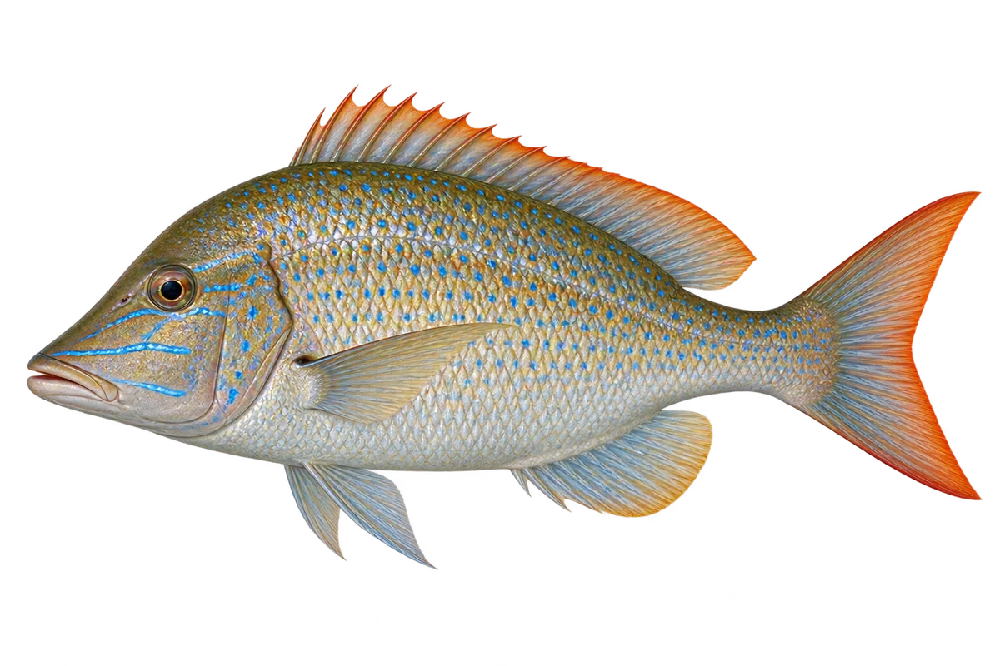

# 星斑裸颊鲷

Lethrinus nebulosus · 鱼 · 2026-10-07

颜色随个体与环境变化，插画用代表色型。

- **浅蓝色小点**：它鳞片上有浅色小点，眼睛周围还有蓝色线条。（VTH-AF-01）
- **不同的家园**：它能在礁区、海草床和近岸沙地生活。（VTH-AF-02）
- **找底下的食物**：它会吃贝类、虾蟹和棘皮动物。（VTH-AF-03）

资料：[Museums Victoria / Fishes of Australia](https://fishesofaustralia.net.au/home/species/2754)。位置：Identification / Summary / Biology / Habitat / species account。

[事实表](../claims.json) · [配音脚本](../scripts/audio-v1.json) · [生成提示与原图索引](../../../design/content/v1/generation.json)

每卡一段介绍、三个点听。新卡没有设置未经标定的局部放大坐标。图为 AI 原创艺术示意，非鉴定照片；交付为 2D 插画及图鉴内容，不代表新增三维捕获物种。
