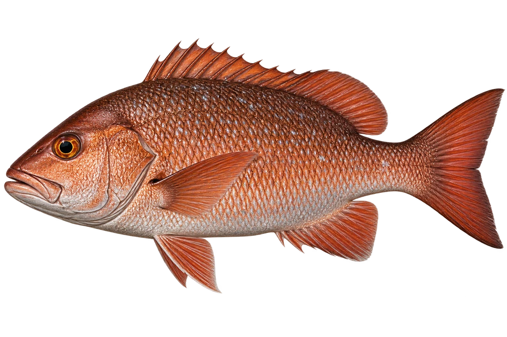

# 红树林红笛鲷

Lutjanus argentimaculatus · 鱼 · 2026-10-07

选择成鱼色型，幼鱼与成鱼环境及色泽有差别。

- **红褐色身体**：它的身体可以从绿褐色到红色，肚子颜色较浅。（VTH-AC-01）
- **幼鱼的家**：幼鱼喜欢红树林河口，长大后会移向较深的礁区。（VTH-AC-02）
- **找小动物**：它会吃小鱼、虾蟹和其他小动物。（VTH-AC-03）

资料：[Museums Victoria / Fishes of Australia](https://fishesofaustralia.net.au/home/species/548)。位置：Identification / Summary / Biology / Habitat / species account。

[事实表](../claims.json) · [配音脚本](../scripts/audio-v1.json) · [生成提示与原图索引](../../../design/content/v1/generation.json)

每卡一段介绍、三个点听。新卡没有设置未经标定的局部放大坐标。图为 AI 原创艺术示意，非鉴定照片；交付为 2D 插画及图鉴内容，不代表新增三维捕获物种。
