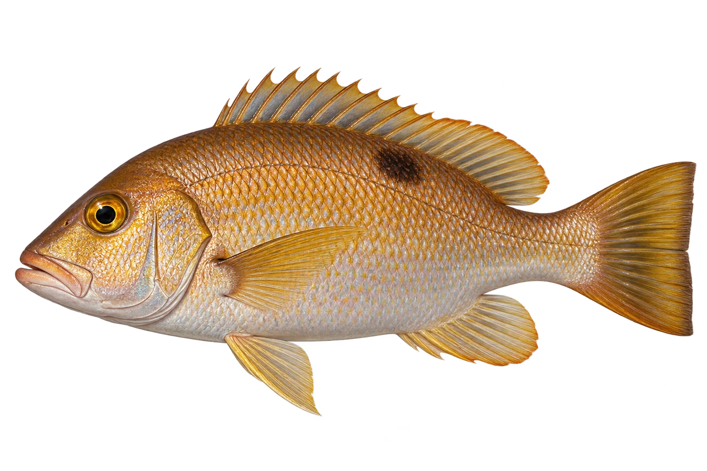

# 金目笛鲷

Lutjanus johnii · 鱼 · 2026-10-07

图片为有明显体侧黑斑的代表个体。

- **金色和黑斑**：它身体带金色光泽，背鳍下方有一块大黑斑。（VTH-AD-01）
- **河口和礁区**：幼鱼会在红树林活动，成鱼也住近岸礁区。（VTH-AD-02）
- **吃小动物**：它会吃鱼、虾蟹和头足类动物。（VTH-AD-03）

资料：[Museums Victoria / Fishes of Australia](https://fishesofaustralia.net.au/home/species/558)。位置：Identification / Summary / Biology / Habitat / species account。

[事实表](../claims.json) · [配音脚本](../scripts/audio-v1.json) · [生成提示与原图索引](../../../design/content/v1/generation.json)

每卡一段介绍、三个点听。新卡没有设置未经标定的局部放大坐标。图为 AI 原创艺术示意，非鉴定照片；交付为 2D 插画及图鉴内容，不代表新增三维捕获物种。
