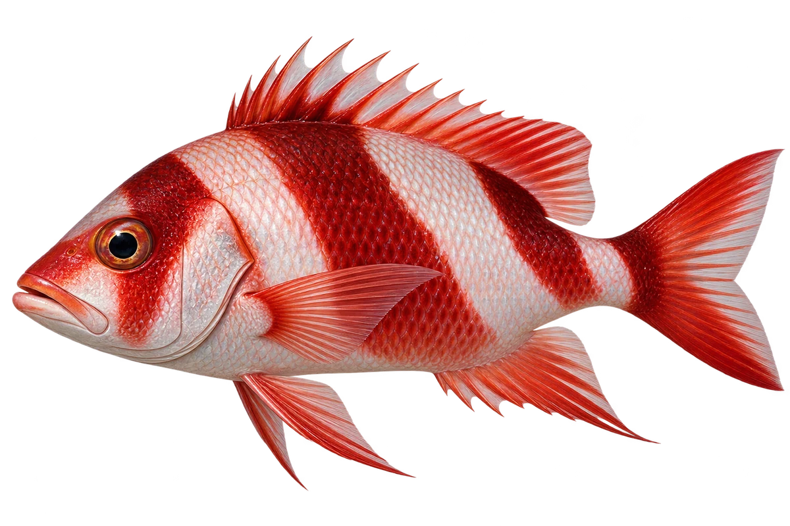

# 红皇帝笛鲷

Lutjanus sebae · 鱼 · 2026-10-07

选择幼鱼三带型；成鱼通常更均匀红色。

- **红色条带**：幼鱼和年轻成鱼有三条明显的深红色带子。（VTH-AE-01）
- **小鱼的躲处**：小幼鱼会躲在海胆的棘之间。（VTH-AE-02）
- **吃什么**：它会吃小鱼、虾蟹和头足类动物。（VTH-AE-03）

资料：[Museums Victoria / Fishes of Australia](https://fishesofaustralia.net.au/home/species/567)。位置：Identification / Summary / Biology / Habitat / species account。

[事实表](../claims.json) · [配音脚本](../scripts/audio-v1.json) · [生成提示与原图索引](../../../design/content/v1/generation.json)

每卡一段介绍、三个点听。新卡没有设置未经标定的局部放大坐标。图为 AI 原创艺术示意，非鉴定照片；交付为 2D 插画及图鉴内容，不代表新增三维捕获物种。
