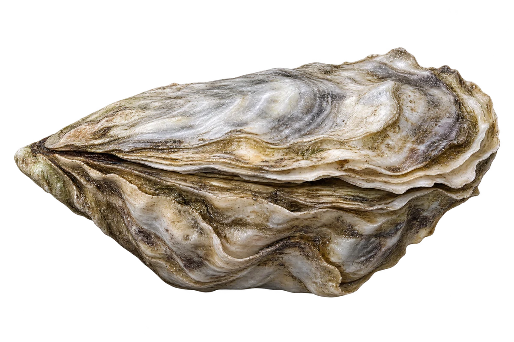

# 太平洋牡蛎（生蚝）

Magallana gigas · 双壳贝 · 2026-10-07

中文食材俗名仅作生活联系；本卡以明确学名表示活体，不作为野外采集、鉴定或可食判断。

- **粗糙的壳**：两片壳的外面凹凸不平。（VTH-DD-01）
- **两壳不一样**：一片壳较平，另一片像深一点的小碗。（VTH-DD-02）
- **过滤小食物**：它过滤海水，吃水里的浮游小生物。（VTH-DD-03）

资料：[NOAA Fisheries](https://www.fisheries.noaa.gov/species/pacific-oyster)。位置：Appearance / biology。

[事实表](../claims.json) · [配音脚本](../scripts/audio-v1.json) · [生成提示与原图索引](../../../design/content/v1/generation.json)

每卡一段介绍、三个点听。新卡没有设置未经标定的局部放大坐标。图为 AI 原创艺术示意，非鉴定照片；交付为 2D 插画及图鉴内容，不代表新增三维捕获物种。
