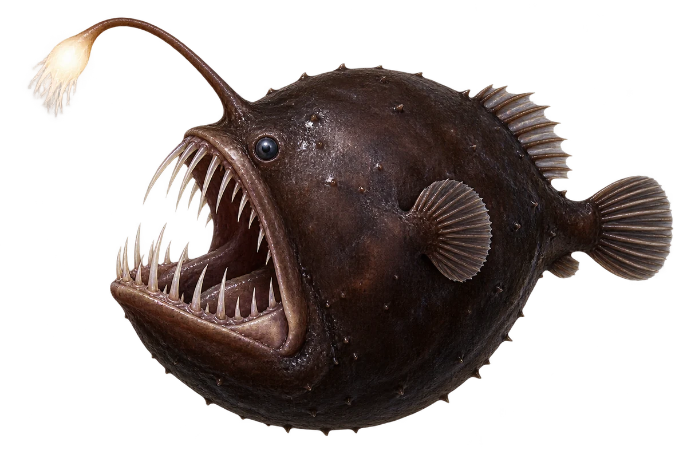

# 黑角鮟鱇

Melanocetus johnsonii · 鱼 · 2026-10-07

选择雌鱼，雄鱼外形与大小不同。

- **头顶有小灯**：它头顶伸出一根像鱼竿的结构，末端能发光。（VTH-AV-01）
- **用光引来食物**：它用这点光，在黑暗中吸引猎物。（VTH-AV-02）
- **黑暗深海**：研究人员曾在五百八十米深的海里拍到它。（VTH-AV-03）

资料：[MBARI](https://www.mbari.org/news/amazing-black-sea-devil-anglerfish-observed-in-monterey-bay/)。位置：Identification / Summary / Biology / Habitat / species account。

[事实表](../claims.json) · [配音脚本](../scripts/audio-v1.json) · [生成提示与原图索引](../../../design/content/v1/generation.json)

每卡一段介绍、三个点听。新卡没有设置未经标定的局部放大坐标。图为 AI 原创艺术示意，非鉴定照片；交付为 2D 插画及图鉴内容，不代表新增三维捕获物种。
