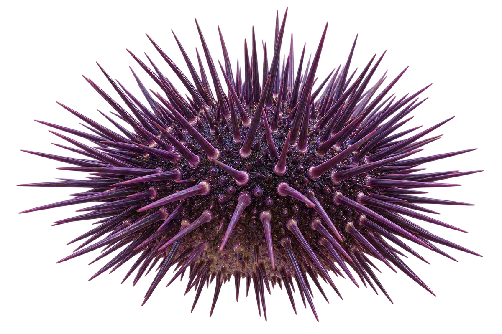

# 光棘球海胆

Mesocentrotus nudus · 其他伙伴 · 2026-10-07

中文食材俗名仅作生活联系；本卡以明确学名表示活体，不作为野外采集、鉴定或可食判断。 旧名 Strongylocentrotus nudus；日本北紫海胆与另一物种紫海胆不同。

- **一种海胆**：这是一种海胆，日本叫它北紫海胆。（VTH-DJ-01）
- **北海道的伙伴**：在北海道附近的沿海可以见到。（VTH-DJ-02）
- **吃海藻**：它会吃海藻，也会吃海藻的幼芽。（VTH-DJ-03）

资料：[北海道立総合研究機構](https://www.hro.or.jp/fisheries/research/central/section/zoushoku/j12s220000001bka/j12s220000001dl8.html)、[WoRMS](https://www.marinespecies.org/aphia.php?p=image&pic=145612)。位置：キタムラサキウニ / distribution / algae。

[事实表](../claims.json) · [配音脚本](../scripts/audio-v1.json) · [生成提示与原图索引](../../../design/content/v1/generation.json)

每卡一段介绍、三个点听。新卡没有设置未经标定的局部放大坐标。图为 AI 原创艺术示意，非鉴定照片；交付为 2D 插画及图鉴内容，不代表新增三维捕获物种。
